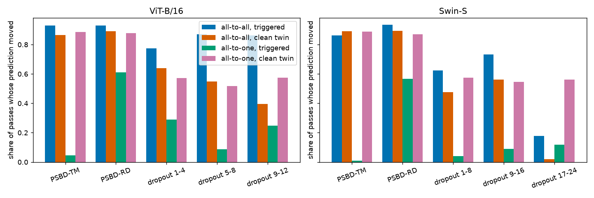
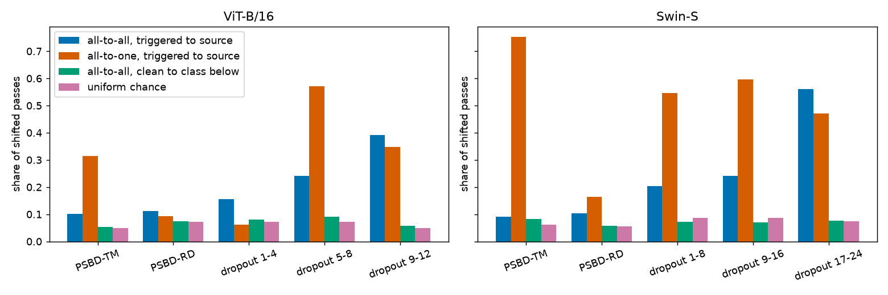
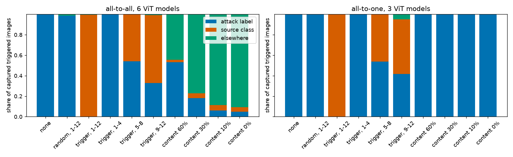
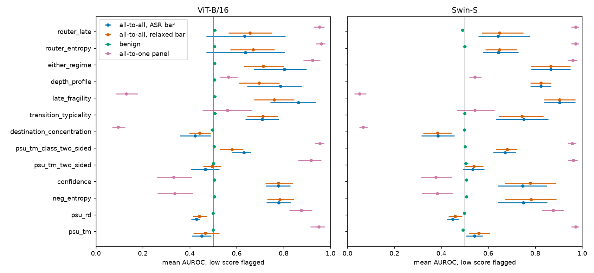

# Prediction-shift detection of all-to-all backdoors

## Question

PSBD flags an input whose prediction survives a perturbation
of the model, and on all-to-all BadNets (label `(y + 1) mod
K`) that premise inverts: triggered predictions move more
than clean ones, so PSU scores below chance
([H5](../../docs/hypothesis/H5-all-to-all-breaks-psbd.md),
[the inversion record](../../docs/all-to-all-inversion.md)).
[H43](../all_to_all_entropy/README.md) showed that the
entropy of the unperturbed softmax separates the triggered
inputs, but entropy perturbs nothing and reads confidence.
The question here is whether any detector of the PSBD kind
(perturb the model at inference, read how the prediction
moves) works on all-to-all ViT-B/16 and Swin-S models, and
whether it can be designed from a measured mechanism rather
than picked from a list.

The answer has to hold without knowledge of the mapping. Our
models were trained with the rotation `(y + 1) mod K` for
simplicity, and a real attacker can use any permutation or a
mapping that is not a bijection. So the rotation, the source
class and the attack label are used only in the mechanism
analysis (`mechanism.py`, `tokens.py`), which says so in
every docstring. The detection statistics (`detect.py`) read
the unperturbed softmax, the class each perturbed pass
predicts and the same quantities on the clean validation
split, and nothing else.

## Scope and limits

BadNets all-to-all is the only all-to-all attack trained
here, and every model shares 1 mapping family, the rotation
by 1. Generalization to other all-to-all attacks (a blend or
warping trigger, a label-consistent variant) and to other
mappings is untested. The relabeling test below shows that
no statistic reads a class identity, which is necessary for
mapping invariance and says nothing about how a different
attack would behave. This directory touches no file under
`paper/`, and the paper does not mention all-to-all.

## Panel

The all-to-all models are not in the coverage ledger, so
`panel.py` applies the ledger's rule by hand with the
ledger's own bars. A model is a successful backdoor when its
ASR is at least 0.85, it has not diverged (clean accuracy at
least half the benign reference) and its clean accuracy is
within 2 points of the benign reference of its architecture
and dataset. All-to-all BadNets on CIFAR-100 and Tiny never
reaches 0.85 on either architecture, so every number is also
read at a relaxed ASR bar of 0.70, chosen before any
detection number was read and labeled wherever it is used.
All-to-all chance is 1 in K, so a model at 0.70 is still a
working implant. The same rule at 5 points admits 1 more
model, read in its own table below.

<!-- results:begin -->
| model | ASR | clean accuracy | benign reference | verdict | PSBD-TM cache |
|---|---:|---:|---:|---|---|
| `swin_cifar100_badnet_a2a_0_005` | 0.150 | 0.865 | 0.867 | dropped: ASR below 0.7 | no |
| `swin_cifar100_badnet_a2a_0_01` | 0.364 | 0.871 | 0.867 | dropped: ASR below 0.7 | no |
| `swin_cifar100_badnet_a2a_0_05` | 0.798 | 0.864 | 0.867 | relaxed ASR bar only | no |
| `swin_cifar100_badnet_a2a_0_1` | 0.823 | 0.868 | 0.867 | relaxed ASR bar only | no |
| `swin_cifar10_badnet_a2a_0_005` | 0.713 | 0.968 | 0.970 | relaxed ASR bar only | no |
| `swin_cifar10_badnet_a2a_0_01` | 0.890 | 0.967 | 0.970 | successful at the 2-point bar | yes |
| `swin_cifar10_badnet_a2a_0_05` | 0.962 | 0.972 | 0.970 | successful at the 2-point bar | yes |
| `swin_cifar10_badnet_a2a_0_1` | 0.964 | 0.966 | 0.970 | successful at the 2-point bar | yes |
| `swin_gtsrb_badnet_a2a_0_005` | 0.755 | 0.990 | 0.985 | relaxed ASR bar only | yes |
| `swin_gtsrb_badnet_a2a_0_01` | 0.926 | 0.984 | 0.985 | successful at the 2-point bar | yes |
| `swin_gtsrb_badnet_a2a_0_05` | 0.962 | 0.988 | 0.985 | successful at the 2-point bar | yes |
| `swin_gtsrb_badnet_a2a_0_1` | 0.979 | 0.987 | 0.985 | successful at the 2-point bar | yes |
| `swin_tiny_badnet_a2a_0_005` | 0.106 | 0.818 | 0.819 | dropped: ASR below 0.7 | no |
| `swin_tiny_badnet_a2a_0_01` | 0.330 | 0.817 | 0.819 | dropped: ASR below 0.7 | no |
| `swin_tiny_badnet_a2a_0_05` | 0.752 | 0.819 | 0.819 | relaxed ASR bar only | no |
| `swin_tiny_badnet_a2a_0_1` | 0.788 | 0.814 | 0.819 | relaxed ASR bar only | no |
| `vit_cifar100_badnet_a2a_0_005` | 0.273 | 0.831 | 0.811 | dropped: ASR below 0.7 | yes |
| `vit_cifar100_badnet_a2a_0_01` | 0.498 | 0.832 | 0.811 | dropped: ASR below 0.7 | yes |
| `vit_cifar100_badnet_a2a_0_05` | 0.800 | 0.825 | 0.811 | relaxed ASR bar only | yes |
| `vit_cifar100_badnet_a2a_0_1` | 0.786 | 0.826 | 0.811 | relaxed ASR bar only | yes |
| `vit_cifar10_badnet_a2a_0_005` | 0.838 | 0.939 | 0.953 | relaxed ASR bar only | yes |
| `vit_cifar10_badnet_a2a_0_01` | 0.941 | 0.952 | 0.953 | successful at the 2-point bar | yes |
| `vit_cifar10_badnet_a2a_0_05` | 0.932 | 0.943 | 0.953 | successful at the 2-point bar | yes |
| `vit_cifar10_badnet_a2a_0_1` | 0.959 | 0.958 | 0.953 | successful at the 2-point bar | yes |
| `vit_gtsrb_badnet_a2a_0_005` | 0.758 | 0.983 | 0.991 | relaxed ASR bar only | yes |
| `vit_gtsrb_badnet_a2a_0_01` | 0.048 | 0.069 | 0.991 | dropped: diverged | yes |
| `vit_gtsrb_badnet_a2a_0_05` | 0.931 | 0.967 | 0.991 | successful at the 5-point bar only | yes |
| `vit_gtsrb_badnet_a2a_0_1` | 0.983 | 0.992 | 0.991 | successful at the 2-point bar | yes |
| `vit_tiny_badnet_a2a_0_005` | 0.188 | 0.757 | 0.755 | dropped: ASR below 0.7 | yes |
| `vit_tiny_badnet_a2a_0_01` | 0.381 | 0.747 | 0.755 | dropped: ASR below 0.7 | yes |
| `vit_tiny_badnet_a2a_0_05` | 0.724 | 0.754 | 0.755 | relaxed ASR bar only | yes |
| `vit_tiny_badnet_a2a_0_1` | 0.734 | 0.760 | 0.755 | relaxed ASR bar only | yes |
<!-- results:end -->

SAM and evasion variants (trained against PSBD-TM) are kept
out of the main reading and scored apart.

<!-- results:begin -->
| variant | models | ASR bar, 2 points | relaxed bar, 2 points | dropped |
|---|---:|---:|---:|---:|
| `sam_rho` | 96 | 44 | 78 | 18 |
| `evade` | 12 | 0 | 1 | 11 |
<!-- results:end -->

## Honesty protocol

The direction of every statistic (low means poisoned) is
written in the docstring of `detect.py` with its reason,
before any AUROC was read. Statistics were developed on
cifar10 and gtsrb all-to-all models, and the choice of
detector was frozen in `detect.py` (`CHOSEN_DETECTOR =
"either_regime"`) with `detection_development.json` as the
record of what was known at that moment. The cifar100 and
tiny models were then scored once. The all-to-one panel (the
ledger's successful models, all 4 datasets) and the benign
references were visible during development, since they are
the cost check and the null control rather than all-to-all
data. `mechanism.py` ran on every dataset before the choice.
It reads no detection statistic, and its pooled tables were
the only view of the confirmation models before they were
scored.

AUROC compares each triggered test image with its own clean
twin (`pair_clean_to_backdoor`). TPR is read at thresholds
set at the 0.01, 0.05, 0.10 quantiles of the clean
validation scores, with the realized false-positive rate on
the clean test twins beside it. Intervals are bootstrap
intervals over models with 5000 resamples and seed 0. Every
gain is paired against PSU-TM on the same models.

`detect.relabeling_check` runs on every model scored. It
permutes the class indices of every softmax and every argmax
the statistics see, validation included, recomputes every
statistic and asserts that no per-input score moves.
`test_invariance.py` runs the same check on synthetic
caches, shows that it catches a statistic reading the
probability of class 0, and asserts that no function on the
statistic path names a label field. The defender views
passed to the statistics carry no label field, so a
statistic that tried to read one would fail with a missing
key.

## Fragility of the triggered prediction

The first mechanism question is whether the inversion is
general. For every image whose clean twin the model
classifies correctly and whose triggered twin the backdoor
captures, `mechanism.py` counts how often each prediction
moves under each cached probe. PSBD-TM and PSBD-RD are read
at their adaptive rate, the depth bands at the rate whose
clean validation shift ratio is nearest 0.6. The Spearman
column correlates, over images, how often the clean twin
moves with how often the triggered twin moves.

ViT-B/16:

<!-- results:begin -->
| probe | models (all-to-all, all-to-one) | all-to-all triggered | all-to-all clean twin | all-to-one triggered | all-to-one clean twin | all-to-all Spearman | all-to-one Spearman |
|---|---|---:|---:|---:|---:|---:|---:|
| PSBD-TM, adaptive rate | 11, 12 | 0.930 | 0.865 | 0.045 | 0.886 | 0.082 | -0.091 |
| PSBD-RD, adaptive rate | 7, 12 | 0.929 | 0.891 | 0.610 | 0.879 | -0.063 | -0.044 |
| dropout, blocks 1 to 4 | 7, 12 | 0.775 | 0.640 | 0.290 | 0.573 | 0.267 | 0.006 |
| dropout, blocks 5 to 8 | 7, 12 | 0.869 | 0.548 | 0.088 | 0.518 | 0.037 | -0.076 |
| dropout, blocks 9 to 12 | 11, 12 | 0.863 | 0.397 | 0.248 | 0.573 | -0.005 | -0.038 |
<!-- results:end -->

Swin-S:

<!-- results:begin -->
| probe | models (all-to-all, all-to-one) | all-to-all triggered | all-to-all clean twin | all-to-one triggered | all-to-one clean twin | all-to-all Spearman | all-to-one Spearman |
|---|---|---:|---:|---:|---:|---:|---:|
| PSBD-TM, adaptive rate | 7, 12 | 0.862 | 0.890 | 0.009 | 0.888 | 0.082 | -0.098 |
| PSBD-RD, adaptive rate | 8, 12 | 0.934 | 0.893 | 0.566 | 0.870 | 0.031 | -0.099 |
| dropout, blocks 1 to 8 | 4, 12 | 0.623 | 0.476 | 0.040 | 0.575 | 0.601 | -0.050 |
| dropout, blocks 9 to 16 | 4, 12 | 0.733 | 0.561 | 0.090 | 0.547 | 0.361 | -0.087 |
| dropout, blocks 17 to 24 | 5, 12 | 0.177 | 0.020 | 0.117 | 0.562 | 0.159 | -0.056 |
<!-- results:end -->

On ViT the triggered all-to-all twin moves more often than
its clean twin under every probe in the table, and on Swin-S
under every probe except PSBD-TM at its adaptive rate, where
nearly every prediction moves (0.862 against 0.890). On
all-to-one the triggered twin moves less under every probe.
Under ViT PSBD-TM the all-to-all gap is small (0.930 against
0.865) for the same reason. The contrast is sharpest when
only the last blocks are perturbed. Dropout on the residual
stream of blocks 9 to 12 moves 0.863 of triggered
predictions and 0.397 of clean ones, and on Swin-S blocks 17
to 24 move a small share of triggered predictions and almost
no clean ones (0.177 against 0.020). The per-image
correlation is weak, so how fragile an image's clean
prediction is barely predicts how fragile its triggered
prediction is (Spearman 0.082 under PSBD-TM).

## Destinations of shifted triggered predictions

The prediction from the brief was that a triggered
prediction, once it breaks, falls back to its source class.
`mechanism.py` counts the shifted passes that land on the
source class (attacker knowledge), and as a control how
often shifted clean passes land on the class 1 below their
prediction, the same offset without a trigger.

ViT-B/16:

<!-- results:begin -->
| probe | models (all-to-all, all-to-one) | all-to-all triggered to source | all-to-one triggered to source | all-to-all clean to class below | uniform chance | same class, triggered | same class, clean |
|---|---|---:|---:|---:|---:|---:|---:|
| PSBD-TM, adaptive rate | 11, 12 | 0.101 | 0.315 | 0.054 | 0.050 | 0.537 | 0.716 |
| PSBD-RD, adaptive rate | 7, 12 | 0.111 | 0.094 | 0.075 | 0.072 | 0.282 | 0.270 |
| dropout, blocks 1 to 4 | 7, 12 | 0.156 | 0.063 | 0.081 | 0.072 | 0.535 | 0.549 |
| dropout, blocks 5 to 8 | 7, 12 | 0.241 | 0.572 | 0.092 | 0.072 | 0.606 | 0.692 |
| dropout, blocks 9 to 12 | 11, 12 | 0.392 | 0.348 | 0.057 | 0.050 | 0.280 | 0.185 |
<!-- results:end -->

Swin-S:

<!-- results:begin -->
| probe | models (all-to-all, all-to-one) | all-to-all triggered to source | all-to-one triggered to source | all-to-all clean to class below | uniform chance | same class, triggered | same class, clean |
|---|---|---:|---:|---:|---:|---:|---:|
| PSBD-TM, adaptive rate | 7, 12 | 0.092 | 0.752 | 0.084 | 0.061 | 0.610 | 0.881 |
| PSBD-RD, adaptive rate | 8, 12 | 0.103 | 0.164 | 0.057 | 0.055 | 0.533 | 0.580 |
| dropout, blocks 1 to 8 | 4, 12 | 0.204 | 0.547 | 0.071 | 0.086 | 0.606 | 0.665 |
| dropout, blocks 9 to 16 | 4, 12 | 0.241 | 0.596 | 0.069 | 0.086 | 0.438 | 0.721 |
| dropout, blocks 17 to 24 | 5, 12 | 0.561 | 0.472 | 0.077 | 0.073 | 0.795 | 0.908 |
<!-- results:end -->

The prediction holds for the late band and fails for the
whole-network probes. Under dropout in blocks 9 to 12, 0.392
of shifted triggered passes land on the source class against
0.050 for a uniform draw and 0.057 for clean passes landing
1 below. Under PSBD-TM at its adaptive rate only 0.101 do,
since that probe also destroys the content the source class
is read from. On the second architecture the last blocks (17
to 24) send 0.561 of them to the source against a uniform
0.073. All-to-one triggered predictions that break under the
same late band also land on their source (0.348), so falling
back to the source is what a broken trigger read does and
owes nothing to the rotation. Destinations are also less
consistent for triggered inputs than for clean ones: among
images that moved in at least 2 passes, all shifted passes
named the same class for 0.537 of triggered images and 0.716
of clean ones under PSBD-TM, and per predicted class the
most common destination took 0.639 against 0.650 of the
shifted passes. The runner-up class of a triggered softmax
is its source for 0.452 of images.

## Tokens and blocks of the trigger read and the source read

`tokens.py` masks tokens deterministically at the attention
input on 256 paired test images per ViT model and reads
where each captured triggered image goes, as shares of
attack label, source class and anything else. It uses the
trigger's token positions, which a defender does not know.
All-to-one BadNets models with the same patch are the
control. Memory was capped at 0.15 of the card, inference
only.

<!-- results:begin -->
| tokens masked at the attention input | all-to-all (6 models): attack label, source, elsewhere | all-to-all clean accuracy | all-to-one (3 models): target, source, elsewhere |
|---|---|---:|---|
| nothing masked | 1.000, 0.000, 0.000 | 1.000 | 1.000, 0.000, 0.000 |
| random tokens, as many as the trigger, blocks 1 to 12 | 0.986, 0.001, 0.013 | 0.994 | 1.000, 0.000, 0.000 |
| trigger tokens, blocks 1 to 12 | 0.000, 0.994, 0.006 | 0.994 | 0.001, 0.999, 0.000 |
| trigger tokens, blocks 1 to 4 | 0.998, 0.000, 0.002 | 0.997 | 1.000, 0.000, 0.000 |
| trigger tokens, blocks 5 to 8 | 0.542, 0.456, 0.002 | 0.999 | 0.536, 0.464, 0.000 |
| trigger tokens, blocks 9 to 12 | 0.329, 0.663, 0.008 | 0.997 | 0.417, 0.535, 0.048 |
| trigger tokens, blocks 1 to 8 | 0.370, 0.629, 0.001 | 0.999 | 0.489, 0.509, 0.001 |
| trigger tokens, blocks 5 to 12 | 0.000, 0.994, 0.006 | 0.995 | 0.003, 0.997, 0.000 |
| trigger visible, 60% of content visible | 0.533, 0.023, 0.444 | 0.647 | 1.000, 0.000, 0.000 |
| trigger visible, 30% of content visible | 0.182, 0.045, 0.773 | 0.268 | 1.000, 0.000, 0.000 |
| trigger visible, 10% of content visible | 0.060, 0.052, 0.887 | 0.086 | 1.000, 0.000, 0.000 |
| trigger visible, no content visible | 0.049, 0.043, 0.908 | 0.066 | 1.000, 0.000, 0.000 |
<!-- results:end -->

Per model, the share of captured triggered images that leave
the attack label when the trigger's tokens are masked in
each span of blocks:

<!-- results:begin -->
| model | label mode | captured pairs | left attack label, trigger masked 1 to 4 | left attack label, trigger masked 5 to 8 | left attack label, trigger masked 9 to 12 | left attack label, trigger masked 1 to 8 | left attack label, trigger masked 5 to 12 | left attack label, trigger masked 1 to 12 | returned to source, trigger masked 5 to 12 |
|---|---|---:|---:|---:|---:|---:|---:|---:|---:|
| `vit_cifar100_badnet_a2a_0_05` | all-to-all | 202 | 0.010 | 0.312 | 1.000 | 0.876 | 1.000 | 1.000 | 0.980 |
| `vit_cifar10_badnet_a2a_0_01` | all-to-all | 234 | 0.000 | 0.201 | 1.000 | 0.521 | 1.000 | 1.000 | 1.000 |
| `vit_cifar10_badnet_a2a_0_05` | all-to-all | 233 | 0.000 | 0.236 | 1.000 | 0.382 | 1.000 | 1.000 | 1.000 |
| `vit_cifar10_badnet_a2a_0_1` | all-to-all | 237 | 0.000 | 0.000 | 1.000 | 0.000 | 1.000 | 1.000 | 0.996 |
| `vit_gtsrb_badnet_a2a_0_05` | all-to-all | 233 | 0.000 | 1.000 | 0.013 | 1.000 | 1.000 | 1.000 | 0.996 |
| `vit_gtsrb_badnet_a2a_0_1` | all-to-all | 249 | 0.000 | 1.000 | 0.016 | 1.000 | 1.000 | 1.000 | 0.992 |
| `vit_cifar10_badnet_a2o_0_01` | all-to-one | 235 | 0.000 | 0.426 | 0.991 | 0.485 | 1.000 | 1.000 | 1.000 |
| `vit_cifar10_badnet_a2o_0_1` | all-to-one | 244 | 0.000 | 0.869 | 0.754 | 0.934 | 0.992 | 0.996 | 0.992 |
| `vit_gtsrb_badnet_a2o_0_1` | all-to-one | 249 | 0.000 | 0.096 | 0.004 | 0.112 | 1.000 | 1.000 | 1.000 |
<!-- results:end -->

The trigger read is a separate component that sits in the
middle and late blocks. Masking the trigger's tokens in
blocks 5 to 12 returns 0.994 of captured triggered images to
their source class on average, and masking as many random
tokens in every block leaves 0.986 on the attack label.
Which span holds the read differs by model (the per-model
table), and wherever it sits, removing it leaves the read of
the source class intact. The source class is read from the
content. With the trigger visible and 30% of the other
tokens, 0.182 of all-to-all images keep the attack label
while the clean twins under the same masks are classified
correctly 0.268 of the time. With no content visible 0.049
keep it and 0.908 land on neither label, while 1.000 of
all-to-one images keep their target. So the all-to-all
output combines a trigger read with a content read, and
breaking either moves it, which is why it is more fragile
than a clean prediction.

## Detectors derived from the mechanism

3 facts from the mechanism shape the detector. A clean
prediction is settled before the last blocks and survives
late perturbation. A triggered all-to-all prediction still
depends on the trigger read and the content read in the
middle and late blocks, and under late perturbation it
breaks and falls back toward its source. A triggered
all-to-one prediction survives almost any perturbation. So
the late band gives `late_fragility`, the late-band PSU with
its sign flipped. The band is `pre_residual_blocks_9_12` on
ViT and `pre_residual_blocks_17_24` on Swin, read at the
rate whose clean validation shift ratio is nearest 0.8.
`either_regime` takes the smaller of the validation ranks of
PSU-TM and of late fragility, so an input abnormal in either
direction is flagged. `depth_profile` is the difference of
the 2 ranks. The statistics the brief proposed are scored
beside them.

On the development models at the moment of the choice
(`detection_development.json`, 4 ViT models at the ASR bar),
PSU-TM read 0.451, late fragility 0.863, either regime 0.803
and the entropy control 0.780. Either regime was chosen over
late fragility because late fragility inverts on all-to-one
while either regime kept 0.898 there against 0.949 for
PSU-TM on the development record.

Development, ViT, ASR bar:

<!-- results:begin -->
| statistic | n | mean AUROC [95% CI] | min | TPR at 0.01, 0.05, 0.10 FPR | realized clean FPR | gain over PSU-TM [95% CI] |
|---|---:|---|---:|---|---|---|
| PSU, PSBD-TM | 4 | 0.451 [0.410, 0.492] | 0.388 | 0.013, 0.021, 0.037 | 0.011, 0.048, 0.102 | +0.000 [+0.000, +0.000] |
| PSU, PSBD-RD | 4 | 0.429 [0.406, 0.442] | 0.395 | 0.017, 0.035, 0.061 | 0.012, 0.054, 0.107 | -0.022 [-0.083, +0.031] |
| negative entropy (control) | 4 | 0.780 [0.727, 0.830] | 0.698 | 0.014, 0.075, 0.206 | 0.009, 0.053, 0.101 | +0.329 [+0.276, +0.416] |
| confidence (control) | 4 | 0.777 [0.725, 0.828] | 0.696 | 0.013, 0.071, 0.203 | 0.010, 0.052, 0.101 | +0.326 [+0.273, +0.415] |
| PSU-TM, 2-sided | 4 | 0.466 [0.405, 0.527] | 0.404 | 0.054, 0.091, 0.121 | 0.010, 0.049, 0.096 | +0.015 [-0.087, +0.117] |
| PSU-TM, class-conditional 2-sided | 4 | 0.631 [0.580, 0.661] | 0.554 | 0.033, 0.136, 0.202 | 0.011, 0.056, 0.105 | +0.180 [+0.130, +0.241] |
| destination concentration | 4 | 0.423 [0.359, 0.491] | 0.330 | 0.000, 0.000, 0.000 | 0.000, 0.000, 0.000 | -0.028 [-0.141, +0.092] |
| transition typicality | 4 | 0.708 [0.637, 0.779] | 0.627 | 0.168, 0.346, 0.412 | 0.012, 0.057, 0.106 | +0.257 [+0.193, +0.330] |
| late fragility | 4 | 0.863 [0.744, 0.938] | 0.689 | 0.239, 0.459, 0.612 | 0.010, 0.048, 0.097 | +0.412 [+0.335, +0.464] |
| depth profile | 4 | 0.787 [0.645, 0.877] | 0.577 | 0.135, 0.319, 0.469 | 0.011, 0.050, 0.101 | +0.336 [+0.237, +0.393] |
| either regime | 4 | 0.803 [0.673, 0.897] | 0.615 | 0.190, 0.360, 0.480 | 0.011, 0.050, 0.096 | +0.352 [+0.269, +0.404] |
| router, entropy (H43) | 4 | 0.638 [0.470, 0.805] | 0.432 | 0.006, 0.040, 0.133 | 0.009, 0.052, 0.106 | +0.186 [+0.000, +0.373] |
| router, late fragility | 4 | 0.634 [0.470, 0.808] | 0.432 | 0.080, 0.169, 0.247 | 0.010, 0.049, 0.101 | +0.183 [+0.000, +0.367] |
<!-- results:end -->

Development, Swin-S, ASR bar:

<!-- results:begin -->
| statistic | n | mean AUROC [95% CI] | min | TPR at 0.01, 0.05, 0.10 FPR | realized clean FPR | gain over PSU-TM [95% CI] |
|---|---:|---|---:|---|---|---|
| PSU, PSBD-TM | 3 | 0.548 [0.503, 0.588] | 0.503 | 0.044, 0.115, 0.165 | 0.010, 0.049, 0.097 | +0.000 [+0.000, +0.000] |
| PSU, PSBD-RD | 3 | 0.471 [0.440, 0.495] | 0.440 | 0.007, 0.031, 0.068 | 0.009, 0.048, 0.107 | -0.077 [-0.112, -0.025] |
| negative entropy (control) | 3 | 0.816 [0.691, 0.913] | 0.691 | 0.053, 0.288, 0.479 | 0.009, 0.053, 0.096 | +0.268 [+0.188, +0.325] |
| confidence (control) | 3 | 0.813 [0.690, 0.909] | 0.690 | 0.048, 0.284, 0.464 | 0.009, 0.052, 0.096 | +0.266 [+0.187, +0.322] |
| PSU-TM, 2-sided | 3 | 0.540 [0.479, 0.584] | 0.479 | 0.042, 0.114, 0.168 | 0.011, 0.052, 0.098 | -0.008 [-0.024, +0.005] |
| PSU-TM, class-conditional 2-sided | 3 | 0.641 [0.562, 0.739] | 0.562 | 0.067, 0.177, 0.291 | 0.009, 0.044, 0.102 | +0.093 [+0.059, +0.152] |
| destination concentration | 3 | 0.378 [0.277, 0.447] | 0.277 | 0.000, 0.000, 0.000 | 0.000, 0.000, 0.000 | -0.170 [-0.227, -0.141] |
| transition typicality | 3 | 0.776 [0.673, 0.898] | 0.673 | 0.333, 0.497, 0.564 | 0.011, 0.050, 0.104 | +0.228 [+0.086, +0.394] |
| router, entropy (H43) | 3 | 0.707 [0.588, 0.844] | 0.588 | 0.046, 0.189, 0.323 | 0.010, 0.053, 0.097 | +0.160 [+0.000, +0.292] |
| router, late fragility | 1 | 0.588 [0.588, 0.588] | 0.588 | 0.081, 0.206, 0.259 | 0.014, 0.052, 0.099 | +0.000 [+0.000, +0.000] |
<!-- results:end -->

## Confirmation on CIFAR-100 and Tiny

No CIFAR-100 or Tiny all-to-all model clears the ASR bar, so
the confirmation reads the relaxed bar only. On ViT (4
models, 4 with the late band) PSU-TM reads 0.403, late
fragility 0.687, either regime 0.608 (worst model 0.559) and
the entropy control 0.712. Either regime flags 0.023, 0.100
and 0.180 of triggered inputs at the 3 budgets.

The confirmation does not reproduce the development reading.
The frozen detector stays above PSU-TM and above the benign
null, and it falls below the entropy control and far below
its own development value, with a TPR at the smallest budget
that no deployment could use. Transition typicality reads
higher in AUROC, and its realized false-positive rate at
every budget is several times the budget, so its thresholds
do not hold.

Confirmation, ViT, relaxed bar:

<!-- results:begin -->
| statistic | n | mean AUROC [95% CI] | min | TPR at 0.01, 0.05, 0.10 FPR | realized clean FPR | gain over PSU-TM [95% CI] |
|---|---:|---|---:|---|---|---|
| PSU, PSBD-TM | 4 | 0.403 [0.380, 0.439] | 0.377 | 0.001, 0.016, 0.050 | 0.010, 0.051, 0.096 | +0.000 [+0.000, +0.000] |
| PSU, PSBD-RD | 1 | 0.410 [0.410, 0.410] | 0.410 | 0.004, 0.016, 0.041 | 0.008, 0.047, 0.097 | +0.026 [+0.026, +0.026] |
| negative entropy (control) | 4 | 0.712 [0.672, 0.748] | 0.658 | 0.032, 0.118, 0.207 | 0.010, 0.048, 0.100 | +0.309 [+0.261, +0.357] |
| confidence (control) | 4 | 0.701 [0.665, 0.735] | 0.652 | 0.030, 0.104, 0.172 | 0.010, 0.049, 0.099 | +0.299 [+0.252, +0.345] |
| PSU-TM, 2-sided | 4 | 0.527 [0.493, 0.566] | 0.478 | 0.028, 0.071, 0.123 | 0.010, 0.048, 0.096 | +0.125 [+0.086, +0.180] |
| PSU-TM, class-conditional 2-sided | 4 | 0.551 [0.510, 0.591] | 0.497 | 0.003, 0.034, 0.108 | 0.012, 0.053, 0.108 | +0.148 [+0.085, +0.211] |
| destination concentration | 4 | 0.437 [0.367, 0.527] | 0.356 | 0.000, 0.000, 0.000 | 0.000, 0.000, 0.000 | +0.034 [-0.065, +0.148] |
| transition typicality | 4 | 0.790 [0.744, 0.838] | 0.738 | 0.648, 0.751, 0.786 | 0.211, 0.290, 0.330 | +0.387 [+0.319, +0.455] |
| late fragility | 4 | 0.687 [0.661, 0.713] | 0.652 | 0.039, 0.165, 0.265 | 0.009, 0.054, 0.099 | +0.285 [+0.264, +0.305] |
| depth profile | 4 | 0.576 [0.533, 0.622] | 0.531 | 0.022, 0.081, 0.142 | 0.010, 0.054, 0.104 | +0.174 [+0.153, +0.195] |
| either regime | 4 | 0.608 [0.571, 0.649] | 0.559 | 0.023, 0.100, 0.180 | 0.010, 0.052, 0.104 | +0.206 [+0.184, +0.225] |
| router, entropy (H43) | 4 | 0.648 [0.522, 0.737] | 0.458 | 0.020, 0.087, 0.171 | 0.010, 0.049, 0.100 | +0.245 [+0.085, +0.357] |
| router, late fragility | 4 | 0.622 [0.511, 0.695] | 0.458 | 0.027, 0.120, 0.213 | 0.011, 0.052, 0.100 | +0.220 [+0.073, +0.305] |
<!-- results:end -->

Confirmation, Swin-S, relaxed bar:

No model in this population has the caches it needs.

## All all-to-all models

ViT, ASR bar, all datasets:

<!-- results:begin -->
| statistic | n | mean AUROC [95% CI] | min | TPR at 0.01, 0.05, 0.10 FPR | realized clean FPR | gain over PSU-TM [95% CI] |
|---|---:|---|---:|---|---|---|
| PSU, PSBD-TM | 4 | 0.451 [0.410, 0.492] | 0.388 | 0.013, 0.021, 0.037 | 0.011, 0.048, 0.102 | +0.000 [+0.000, +0.000] |
| PSU, PSBD-RD | 4 | 0.429 [0.406, 0.442] | 0.395 | 0.017, 0.035, 0.061 | 0.012, 0.054, 0.107 | -0.022 [-0.083, +0.031] |
| negative entropy (control) | 4 | 0.780 [0.727, 0.830] | 0.698 | 0.014, 0.075, 0.206 | 0.009, 0.053, 0.101 | +0.329 [+0.276, +0.416] |
| confidence (control) | 4 | 0.777 [0.725, 0.828] | 0.696 | 0.013, 0.071, 0.203 | 0.010, 0.052, 0.101 | +0.326 [+0.273, +0.415] |
| PSU-TM, 2-sided | 4 | 0.466 [0.405, 0.527] | 0.404 | 0.054, 0.091, 0.121 | 0.010, 0.049, 0.096 | +0.015 [-0.087, +0.117] |
| PSU-TM, class-conditional 2-sided | 4 | 0.631 [0.580, 0.661] | 0.554 | 0.033, 0.136, 0.202 | 0.011, 0.056, 0.105 | +0.180 [+0.130, +0.241] |
| destination concentration | 4 | 0.423 [0.359, 0.491] | 0.330 | 0.000, 0.000, 0.000 | 0.000, 0.000, 0.000 | -0.028 [-0.141, +0.092] |
| transition typicality | 4 | 0.708 [0.637, 0.779] | 0.627 | 0.168, 0.346, 0.412 | 0.012, 0.057, 0.106 | +0.257 [+0.193, +0.330] |
| late fragility | 4 | 0.863 [0.744, 0.938] | 0.689 | 0.239, 0.459, 0.612 | 0.010, 0.048, 0.097 | +0.412 [+0.335, +0.464] |
| depth profile | 4 | 0.787 [0.645, 0.877] | 0.577 | 0.135, 0.319, 0.469 | 0.011, 0.050, 0.101 | +0.336 [+0.237, +0.393] |
| either regime | 4 | 0.803 [0.673, 0.897] | 0.615 | 0.190, 0.360, 0.480 | 0.011, 0.050, 0.096 | +0.352 [+0.269, +0.404] |
| router, entropy (H43) | 4 | 0.638 [0.470, 0.805] | 0.432 | 0.006, 0.040, 0.133 | 0.009, 0.052, 0.106 | +0.186 [+0.000, +0.373] |
| router, late fragility | 4 | 0.634 [0.470, 0.808] | 0.432 | 0.080, 0.169, 0.247 | 0.010, 0.049, 0.101 | +0.183 [+0.000, +0.367] |
<!-- results:end -->

ViT, ASR bar at 5 points, all datasets:

<!-- results:begin -->
| statistic | n | mean AUROC [95% CI] | min | TPR at 0.01, 0.05, 0.10 FPR | realized clean FPR | gain over PSU-TM [95% CI] |
|---|---:|---|---:|---|---|---|
| PSU, PSBD-TM | 5 | 0.423 [0.360, 0.480] | 0.312 | 0.016, 0.028, 0.041 | 0.011, 0.046, 0.099 | +0.000 [+0.000, +0.000] |
| PSU, PSBD-RD | 5 | 0.425 [0.406, 0.441] | 0.395 | 0.019, 0.041, 0.064 | 0.011, 0.052, 0.105 | +0.002 [-0.065, +0.061] |
| negative entropy (control) | 5 | 0.784 [0.736, 0.824] | 0.698 | 0.017, 0.081, 0.225 | 0.010, 0.052, 0.103 | +0.360 [+0.281, +0.441] |
| confidence (control) | 5 | 0.781 [0.732, 0.822] | 0.696 | 0.015, 0.079, 0.219 | 0.010, 0.052, 0.103 | +0.357 [+0.278, +0.438] |
| PSU-TM, 2-sided | 5 | 0.483 [0.422, 0.545] | 0.404 | 0.047, 0.088, 0.118 | 0.010, 0.050, 0.095 | +0.060 [-0.058, +0.178] |
| PSU-TM, class-conditional 2-sided | 5 | 0.613 [0.568, 0.657] | 0.543 | 0.029, 0.113, 0.176 | 0.011, 0.057, 0.105 | +0.190 [+0.141, +0.239] |
| destination concentration | 5 | 0.442 [0.378, 0.506] | 0.330 | 0.000, 0.000, 0.000 | 0.000, 0.000, 0.000 | +0.018 [-0.094, +0.131] |
| transition typicality | 5 | 0.674 [0.595, 0.754] | 0.537 | 0.146, 0.294, 0.347 | 0.013, 0.057, 0.105 | +0.251 [+0.200, +0.309] |
| late fragility | 5 | 0.856 [0.769, 0.924] | 0.689 | 0.203, 0.429, 0.586 | 0.010, 0.049, 0.098 | +0.433 [+0.363, +0.485] |
| depth profile | 5 | 0.768 [0.654, 0.862] | 0.577 | 0.113, 0.270, 0.406 | 0.011, 0.051, 0.102 | +0.345 [+0.266, +0.391] |
| either regime | 5 | 0.794 [0.700, 0.873] | 0.615 | 0.162, 0.333, 0.457 | 0.011, 0.049, 0.095 | +0.370 [+0.298, +0.422] |
| router, entropy (H43) | 5 | 0.670 [0.520, 0.811] | 0.432 | 0.010, 0.053, 0.167 | 0.009, 0.052, 0.107 | +0.246 [+0.057, +0.436] |
| router, late fragility | 5 | 0.673 [0.514, 0.832] | 0.432 | 0.077, 0.197, 0.293 | 0.009, 0.050, 0.101 | +0.250 [+0.060, +0.440] |
<!-- results:end -->

ViT, relaxed bar, all datasets:

<!-- results:begin -->
| statistic | n | mean AUROC [95% CI] | min | TPR at 0.01, 0.05, 0.10 FPR | realized clean FPR | gain over PSU-TM [95% CI] |
|---|---:|---|---:|---|---|---|
| PSU, PSBD-TM | 10 | 0.467 [0.415, 0.526] | 0.377 | 0.016, 0.035, 0.063 | 0.011, 0.050, 0.099 | +0.000 [+0.000, +0.000] |
| PSU, PSBD-RD | 6 | 0.441 [0.413, 0.474] | 0.395 | 0.015, 0.036, 0.068 | 0.011, 0.051, 0.104 | -0.025 [-0.075, +0.022] |
| negative entropy (control) | 10 | 0.784 [0.730, 0.844] | 0.658 | 0.058, 0.184, 0.323 | 0.010, 0.051, 0.102 | +0.317 [+0.285, +0.356] |
| confidence (control) | 10 | 0.777 [0.722, 0.838] | 0.652 | 0.047, 0.168, 0.302 | 0.010, 0.051, 0.101 | +0.311 [+0.278, +0.350] |
| PSU-TM, 2-sided | 10 | 0.495 [0.457, 0.532] | 0.404 | 0.041, 0.085, 0.122 | 0.010, 0.048, 0.096 | +0.028 [-0.049, +0.104] |
| PSU-TM, class-conditional 2-sided | 10 | 0.580 [0.528, 0.628] | 0.406 | 0.027, 0.105, 0.171 | 0.011, 0.053, 0.105 | +0.113 [+0.028, +0.183] |
| destination concentration | 10 | 0.443 [0.397, 0.489] | 0.330 | 0.000, 0.000, 0.000 | 0.000, 0.000, 0.000 | -0.024 [-0.091, +0.049] |
| transition typicality | 10 | 0.712 [0.645, 0.774] | 0.498 | 0.327, 0.445, 0.504 | 0.090, 0.142, 0.191 | +0.245 [+0.128, +0.350] |
| late fragility | 10 | 0.760 [0.675, 0.846] | 0.501 | 0.163, 0.323, 0.435 | 0.010, 0.051, 0.099 | +0.293 [+0.178, +0.378] |
| depth profile | 10 | 0.695 [0.609, 0.783] | 0.531 | 0.100, 0.229, 0.335 | 0.011, 0.053, 0.104 | +0.228 [+0.149, +0.303] |
| either regime | 10 | 0.714 [0.631, 0.802] | 0.559 | 0.137, 0.265, 0.357 | 0.011, 0.051, 0.101 | +0.247 [+0.160, +0.322] |
| router, entropy (H43) | 10 | 0.670 [0.573, 0.762] | 0.432 | 0.031, 0.100, 0.206 | 0.010, 0.051, 0.103 | +0.203 [+0.094, +0.307] |
| router, late fragility | 10 | 0.657 [0.565, 0.751] | 0.432 | 0.104, 0.202, 0.285 | 0.011, 0.052, 0.101 | +0.190 [+0.089, +0.287] |
<!-- results:end -->

Swin-S, ASR bar:

<!-- results:begin -->
| statistic | n | mean AUROC [95% CI] | min | TPR at 0.01, 0.05, 0.10 FPR | realized clean FPR | gain over PSU-TM [95% CI] |
|---|---:|---|---:|---|---|---|
| PSU, PSBD-TM | 6 | 0.541 [0.505, 0.575] | 0.465 | 0.041, 0.113, 0.164 | 0.011, 0.051, 0.103 | +0.000 [+0.000, +0.000] |
| PSU, PSBD-RD | 6 | 0.449 [0.422, 0.474] | 0.393 | 0.008, 0.029, 0.068 | 0.009, 0.050, 0.106 | -0.092 [-0.139, -0.046] |
| negative entropy (control) | 6 | 0.749 [0.641, 0.852] | 0.569 | 0.048, 0.215, 0.368 | 0.011, 0.052, 0.097 | +0.208 [+0.102, +0.297] |
| confidence (control) | 6 | 0.747 [0.640, 0.850] | 0.569 | 0.040, 0.212, 0.359 | 0.011, 0.052, 0.097 | +0.207 [+0.101, +0.295] |
| PSU-TM, 2-sided | 6 | 0.534 [0.492, 0.583] | 0.474 | 0.035, 0.107, 0.159 | 0.010, 0.052, 0.099 | -0.006 [-0.032, +0.016] |
| PSU-TM, class-conditional 2-sided | 6 | 0.672 [0.620, 0.717] | 0.562 | 0.064, 0.215, 0.338 | 0.009, 0.047, 0.100 | +0.131 [+0.086, +0.184] |
| destination concentration | 6 | 0.385 [0.315, 0.456] | 0.269 | 0.000, 0.000, 0.000 | 0.000, 0.000, 0.000 | -0.155 [-0.244, -0.057] |
| transition typicality | 6 | 0.751 [0.632, 0.856] | 0.498 | 0.285, 0.431, 0.510 | 0.011, 0.049, 0.095 | +0.210 [+0.109, +0.309] |
| late fragility | 4 | 0.904 [0.838, 0.971] | 0.835 | 0.252, 0.507, 0.649 | 0.012, 0.053, 0.103 | +0.357 [+0.283, +0.403] |
| depth profile | 4 | 0.824 [0.779, 0.867] | 0.752 | 0.132, 0.330, 0.457 | 0.011, 0.050, 0.099 | +0.276 [+0.236, +0.305] |
| either regime | 4 | 0.866 [0.783, 0.950] | 0.755 | 0.204, 0.441, 0.586 | 0.012, 0.056, 0.106 | +0.319 [+0.256, +0.382] |
| router, entropy (H43) | 6 | 0.644 [0.577, 0.729] | 0.548 | 0.038, 0.146, 0.247 | 0.010, 0.053, 0.103 | +0.103 [+0.023, +0.197] |
| router, late fragility | 4 | 0.641 [0.558, 0.778] | 0.548 | 0.052, 0.159, 0.246 | 0.012, 0.055, 0.108 | +0.094 [+0.000, +0.282] |
<!-- results:end -->

Swin-S, relaxed bar:

<!-- results:begin -->
| statistic | n | mean AUROC [95% CI] | min | TPR at 0.01, 0.05, 0.10 FPR | realized clean FPR | gain over PSU-TM [95% CI] |
|---|---:|---|---:|---|---|---|
| PSU, PSBD-TM | 7 | 0.560 [0.517, 0.607] | 0.465 | 0.044, 0.124, 0.184 | 0.010, 0.051, 0.103 | +0.000 [+0.000, +0.000] |
| PSU, PSBD-RD | 7 | 0.459 [0.431, 0.488] | 0.393 | 0.009, 0.035, 0.080 | 0.010, 0.050, 0.106 | -0.100 [-0.144, -0.057] |
| negative entropy (control) | 7 | 0.782 [0.672, 0.891] | 0.569 | 0.083, 0.322, 0.457 | 0.011, 0.052, 0.098 | +0.222 [+0.126, +0.302] |
| confidence (control) | 7 | 0.780 [0.671, 0.889] | 0.569 | 0.071, 0.319, 0.449 | 0.011, 0.052, 0.097 | +0.220 [+0.125, +0.300] |
| PSU-TM, 2-sided | 7 | 0.539 [0.501, 0.578] | 0.474 | 0.037, 0.109, 0.167 | 0.010, 0.052, 0.101 | -0.021 [-0.058, +0.010] |
| PSU-TM, class-conditional 2-sided | 7 | 0.681 [0.632, 0.722] | 0.562 | 0.077, 0.232, 0.354 | 0.009, 0.048, 0.101 | +0.122 [+0.081, +0.172] |
| destination concentration | 7 | 0.384 [0.323, 0.444] | 0.269 | 0.000, 0.000, 0.000 | 0.000, 0.000, 0.000 | -0.176 [-0.255, -0.085] |
| transition typicality | 7 | 0.744 [0.644, 0.835] | 0.498 | 0.285, 0.417, 0.498 | 0.011, 0.050, 0.097 | +0.184 [+0.088, +0.283] |
| late fragility | 4 | 0.904 [0.838, 0.971] | 0.835 | 0.252, 0.507, 0.649 | 0.012, 0.053, 0.103 | +0.357 [+0.283, +0.403] |
| depth profile | 4 | 0.824 [0.779, 0.867] | 0.752 | 0.132, 0.330, 0.457 | 0.011, 0.050, 0.099 | +0.276 [+0.236, +0.305] |
| either regime | 4 | 0.866 [0.783, 0.950] | 0.755 | 0.204, 0.441, 0.586 | 0.012, 0.056, 0.106 | +0.319 [+0.256, +0.382] |
| router, entropy (H43) | 7 | 0.648 [0.588, 0.722] | 0.548 | 0.041, 0.153, 0.254 | 0.010, 0.053, 0.103 | +0.088 [+0.020, +0.172] |
| router, late fragility | 5 | 0.648 [0.572, 0.749] | 0.548 | 0.054, 0.166, 0.257 | 0.012, 0.055, 0.107 | +0.075 [+0.000, +0.226] |
<!-- results:end -->

Per model:

<!-- results:begin -->
| model | split | verdict | ASR | PSU, PSBD-TM | negative entropy (control) | late fragility | either regime |
|---|---|---|---:|---:|---:|---:|---:|
| `swin_cifar10_badnet_a2a_0_01` | development | successful at the 2-point bar | 0.890 | 0.548 | 0.875 | 0.959 | 0.929 |
| `swin_cifar10_badnet_a2a_0_05` | development | successful at the 2-point bar | 0.962 | 0.589 | 0.569 | 0.835 | 0.811 |
| `swin_cifar10_badnet_a2a_0_1` | development | successful at the 2-point bar | 0.964 | 0.465 | 0.602 | 0.841 | 0.755 |
| `swin_gtsrb_badnet_a2a_0_005` | development | relaxed ASR bar only | 0.755 | 0.674 | 0.979 | -- | -- |
| `swin_gtsrb_badnet_a2a_0_01` | development | successful at the 2-point bar | 0.926 | 0.588 | 0.913 | 0.983 | 0.970 |
| `swin_gtsrb_badnet_a2a_0_05` | development | successful at the 2-point bar | 0.962 | 0.552 | 0.844 | -- | -- |
| `swin_gtsrb_badnet_a2a_0_1` | development | successful at the 2-point bar | 0.979 | 0.503 | 0.691 | -- | -- |
| `vit_cifar100_badnet_a2a_0_05` | confirmation | relaxed ASR bar only | 0.800 | 0.384 | 0.759 | 0.652 | 0.559 |
| `vit_cifar100_badnet_a2a_0_1` | confirmation | relaxed ASR bar only | 0.786 | 0.377 | 0.716 | 0.670 | 0.607 |
| `vit_cifar10_badnet_a2a_0_005` | development | relaxed ASR bar only | 0.838 | 0.607 | 0.910 | 0.896 | 0.914 |
| `vit_cifar10_badnet_a2a_0_01` | development | successful at the 2-point bar | 0.941 | 0.509 | 0.812 | 0.949 | 0.920 |
| `vit_cifar10_badnet_a2a_0_05` | development | successful at the 2-point bar | 0.932 | 0.432 | 0.698 | 0.906 | 0.829 |
| `vit_cifar10_badnet_a2a_0_1` | development | successful at the 2-point bar | 0.959 | 0.475 | 0.761 | 0.908 | 0.847 |
| `vit_gtsrb_badnet_a2a_0_005` | development | relaxed ASR bar only | 0.758 | 0.645 | 0.962 | 0.501 | 0.581 |
| `vit_gtsrb_badnet_a2a_0_05` | development | successful at the 5-point bar only | 0.931 | 0.312 | 0.798 | 0.828 | 0.756 |
| `vit_gtsrb_badnet_a2a_0_1` | development | successful at the 2-point bar | 0.983 | 0.388 | 0.849 | 0.689 | 0.615 |
| `vit_tiny_badnet_a2a_0_05` | confirmation | relaxed ASR bar only | 0.724 | 0.458 | 0.714 | 0.718 | 0.664 |
| `vit_tiny_badnet_a2a_0_1` | confirmation | relaxed ASR bar only | 0.734 | 0.392 | 0.658 | 0.709 | 0.603 |
<!-- results:end -->

## Cost on the all-to-one panel

A defender does not know which regime a model is in, so
every statistic is also scored on the ledger's successful
all-to-one models. Thresholds are validation quantiles, so
the realized clean false-positive rate stays at the budget
by construction, and the cost shows up as lost AUROC and
TPR.

ViT-B/16:

<!-- results:begin -->
| statistic | n | AUROC | PSU-TM, same models | change [95% CI] | TPR at 0.01, 0.05, 0.10 FPR | PSU-TM TPR, same models | realized clean FPR |
|---|---:|---:|---:|---|---|---|---|
| negative entropy (control) | 56 | 0.336 | 0.951 | -0.614 [-0.701, -0.518] | 0.002, 0.023, 0.037 | 0.735, 0.841, 0.872 | 0.010, 0.049, 0.100 |
| transition typicality | 56 | 0.561 | 0.951 | -0.389 [-0.501, -0.275] | 0.179, 0.327, 0.392 | 0.735, 0.841, 0.872 | 0.090, 0.141, 0.187 |
| late fragility | 56 | 0.129 | 0.951 | -0.822 [-0.880, -0.750] | 0.002, 0.010, 0.018 | 0.735, 0.841, 0.872 | 0.011, 0.053, 0.105 |
| depth profile | 56 | 0.565 | 0.951 | -0.386 [-0.424, -0.342] | 0.015, 0.043, 0.070 | 0.735, 0.841, 0.872 | 0.009, 0.046, 0.094 |
| either regime | 56 | 0.923 | 0.951 | -0.027 [-0.048, -0.011] | 0.654, 0.810, 0.849 | 0.735, 0.841, 0.872 | 0.011, 0.050, 0.098 |
| router, entropy (H43) | 56 | 0.960 | 0.951 | +0.010 [-0.008, +0.037] | 0.735, 0.841, 0.873 | 0.735, 0.841, 0.872 | 0.010, 0.046, 0.092 |
| router, late fragility | 56 | 0.954 | 0.951 | +0.003 [-0.016, +0.025] | 0.736, 0.845, 0.879 | 0.735, 0.841, 0.872 | 0.010, 0.047, 0.094 |
<!-- results:end -->

Swin-S:

<!-- results:begin -->
| statistic | n | AUROC | PSU-TM, same models | change [95% CI] | TPR at 0.01, 0.05, 0.10 FPR | PSU-TM TPR, same models | realized clean FPR |
|---|---:|---:|---:|---|---|---|---|
| negative entropy (control) | 63 | 0.382 | 0.973 | -0.590 [-0.663, -0.511] | 0.007, 0.039, 0.070 | 0.824, 0.905, 0.939 | 0.012, 0.052, 0.102 |
| transition typicality | 63 | 0.544 | 0.973 | -0.429 [-0.509, -0.344] | 0.124, 0.208, 0.282 | 0.824, 0.905, 0.939 | 0.036, 0.077, 0.125 |
| late fragility | 63 | 0.052 | 0.973 | -0.921 [-0.955, -0.875] | 0.000, 0.001, 0.002 | 0.824, 0.905, 0.939 | 0.011, 0.051, 0.101 |
| depth profile | 63 | 0.543 | 0.973 | -0.429 [-0.460, -0.394] | 0.007, 0.017, 0.029 | 0.824, 0.905, 0.939 | 0.009, 0.048, 0.096 |
| either regime | 63 | 0.961 | 0.973 | -0.011 [-0.017, -0.006] | 0.799, 0.867, 0.906 | 0.824, 0.905, 0.939 | 0.010, 0.047, 0.095 |
| router, entropy (H43) | 63 | 0.973 | 0.973 | +0.000 [+0.000, +0.000] | 0.824, 0.905, 0.939 | 0.824, 0.905, 0.939 | 0.009, 0.044, 0.092 |
| router, late fragility | 63 | 0.973 | 0.973 | +0.000 [+0.000, +0.000] | 0.824, 0.905, 0.939 | 0.824, 0.905, 0.939 | 0.009, 0.044, 0.092 |
<!-- results:end -->

Either regime reads 0.923 on the 56 ViT all-to-one models
against 0.951 for PSU-TM on the same models, a change of
-0.027 [-0.048, -0.011]. TPR at the smallest budget falls
from 0.735 to 0.654. On Swin-S it reads 0.961 against 0.973.
Late fragility alone reads 0.129 on all-to-one and the
entropy control 0.336, so neither can be deployed without
knowing the regime.

## Null control

Benign models probed with the BadNets trigger have nothing
to detect and must read near 0.5.

<!-- results:begin -->
| statistic | ViT models | ViT mean AUROC | Swin models | Swin mean AUROC |
|---|---:|---:|---:|---:|
| PSU, PSBD-TM | 4 | 0.500 | 3 | 0.493 |
| PSU, PSBD-RD | 4 | 0.499 | 3 | 0.498 |
| negative entropy (control) | 4 | 0.506 | 3 | 0.506 |
| confidence (control) | 4 | 0.506 | 3 | 0.506 |
| PSU-TM, 2-sided | 4 | 0.501 | 3 | 0.503 |
| PSU-TM, class-conditional 2-sided | 4 | 0.504 | 3 | 0.501 |
| destination concentration | 4 | 0.496 | 3 | 0.499 |
| transition typicality | 4 | 0.506 | 3 | 0.500 |
| late fragility | 4 | 0.506 | 0 | -- |
| depth profile | 4 | 0.505 | 0 | -- |
| either regime | 4 | 0.505 | 0 | -- |
| router, entropy (H43) | 4 | 0.506 | 3 | 0.500 |
| router, late fragility | 4 | 0.505 | 1 | 0.490 |
<!-- results:end -->

## SAM and evasion variants

<!-- results:begin -->
| population | statistic | n | mean AUROC [95% CI] |
|---|---|---:|---|
| vit, SAM and evasion variants | PSU, PSBD-TM | 38 | 0.411 [0.394, 0.428] |
| vit, SAM and evasion variants | negative entropy (control) | 38 | 0.744 [0.714, 0.775] |
| vit, SAM and evasion variants | late fragility | 15 | 0.899 [0.856, 0.936] |
| vit, SAM and evasion variants | either regime | 15 | 0.862 [0.805, 0.911] |
<!-- results:end -->

## Verdicts

**Idea 1, the mechanism.** Supported with a correction.
Triggered all-to-all predictions are more fragile than clean
ones under every probe but Swin-S PSBD-TM at its saturating
adaptive rate, and the token masks show why: the output
combines a trigger read in the middle or late blocks with a
content read of the source class, and breaking either moves
it. Shifted triggered predictions land on the source class
most often when the perturbation is confined to the last
blocks. Whole-network probes send them elsewhere, since they
also destroy the content.

**Idea 2, destination structure.** Refuted for the
whole-network probe the statistics read. Under PSBD-TM
triggered destinations are less consistent across passes
than clean ones and no more concentrated per predicted
class, because clean predictions under heavy perturbation
collapse onto a few attractor classes and triggered ones
scatter. Under the late band on ViT the order reverses,
since those passes fall back to the source. Late fragility
uses that band through the shift rate rather than through
where the passes land. Destination concentration reads 0.423
on development. Transition typicality reads 0.708 there, and
its discrete scores tie so heavily on 100 and 200 classes
that the validation quantile no longer sets the
false-positive rate.

**Idea 3, 2-sided and class-conditional PSU, routers,
confidence.** 2-sided PSU-TM reads 0.466 and the
class-conditional version 0.631 on development, because
PSU-TM's triggered and clean distributions overlap almost
entirely at the adaptive rate. Both routers fail: the sign
of the pool shift d does not flip reliably on all-to-all at
these poison rates, so the H43 router reads 0.638 and the
late router 0.634. Entropy separates all-to-all, and it
perturbs nothing, measures confidence and inverts on
all-to-one (0.336), so it is not a PSBD detector.

**Idea 4, the late-band probe.** Supported on the
development models and not confirmed at that strength. Late
fragility and either regime separate CIFAR-10 all-to-all
well on both architectures, GTSRB unevenly and CIFAR-100 and
Tiny weakly (per-model table).

## Whether anything is possible

Something is possible, and it is not a usable detector yet.
A PSBD-like probe that perturbs only the last third of the
blocks and counts how often the prediction moves separates
all-to-all triggered inputs from clean ones where the
mechanism says it should, because a triggered all-to-all
prediction still depends on late processing that a settled
clean prediction no longer needs. On the ViT models at the
ASR bar late fragility reads 0.863 against 0.451 for PSU-TM
(Swin-S 0.904 against 0.541 on 4 models), and
`either_regime` covers both regimes without knowing the
regime of a model, at 0.803 on all-to-all and 0.923 on the
all-to-one panel. On the confirmation datasets the frozen
detector reads 0.608, with TPR 0.023 at the smallest budget.

So the direct answer is no for deployment and yes for the
direction. No mapping-agnostic statistic tested here reaches
a usable TPR at a low false-positive rate on the CIFAR-100
and Tiny all-to-all models, and the 2 statistics that read
higher there are entropy (a confidence reading) and
transition typicality (whose thresholds do not hold). The
per-model token table suggests a reason that is a hypothesis
until tested: on some models the trigger is read in blocks 5
to 8, ahead of the band perturbed, so a band fixed at the
last third misses the read. A band covering the middle and
late blocks, chosen on the development models and confirmed
on a fresh all-to-all attack, is the next test. All of this
is 1 attack and 1 mapping family, and it shows nothing about
any other all-to-all attack.

## Status and future work

The user moved the all-to-all detector to future work for
this paper on 2026-09-29. The GPU queue was stopped that
night and the running sweep was allowed to finish. What is
measured above stands. These items are open.

- Swin-S late-band sweeps for `swin_gtsrb_badnet_a2a_0_005`, `_0_05` and `_0_1` and for the 3 Swin-S benign references were queued in `run_gpu.sh` and never ran, so the Swin-S late-band rows rest on the CIFAR-10 models and 1 GTSRB model and the Swin-S null control has no late-band row. PSBD-TM for `swin_cifar100_badnet_a2a_0_1` did not run either.
- The token masks ran on the models in the per-model token table. The CIFAR-100 and Tiny all-to-all models beyond the first, and their all-to-one controls, were queued and removed.
- A band covering the middle and late blocks, chosen on the development models, is the next detector to test, because the token table puts the trigger read ahead of blocks 9 to 12 on some models.
- A second all-to-all attack (a blend or warping trigger) and a mapping other than the rotation by 1 are needed before any claim about all-to-all in general.

## Commands and wall time

`render_readme.py` writes this file from
`README.template.md` and the records under
`results/_experiments/all_to_all_detection/`. Edits go to
the template, and every number comes from a record.

    source .venv/bin/activate
    python experiments/all_to_all_detection/panel.py
    python experiments/all_to_all_detection/mechanism.py --datasets cifar10 gtsrb --out mechanism_development.json
    python experiments/all_to_all_detection/mechanism.py
    bash experiments/all_to_all_detection/run_tokens.sh FOLDERS
    bash experiments/all_to_all_detection/run_gpu.sh
    python experiments/all_to_all_detection/detect.py --datasets cifar10 gtsrb --out detection_development.json
    python experiments/all_to_all_detection/detect.py
    python experiments/all_to_all_detection/tokens.py --summarize-only
    python experiments/all_to_all_detection/figures.py
    python experiments/all_to_all_detection/render_readme.py
    python -m pytest experiments/all_to_all_detection/test_invariance.py -q

<!-- results:begin -->
| step | where | wall time |
|---|---|---|
| `panel.py` and `mechanism.py` | CPU | 5.5 min |
| `detect.py`, every group | CPU | 0.9 min |
| `tokens.py`, 9 models | login GPU | 2.4 min of forward passes |
| `run_gpu.sh`, 8 sweeps | login GPU | 73.5 min from the first to the last rate file, lock waits excluded |
<!-- results:end -->
