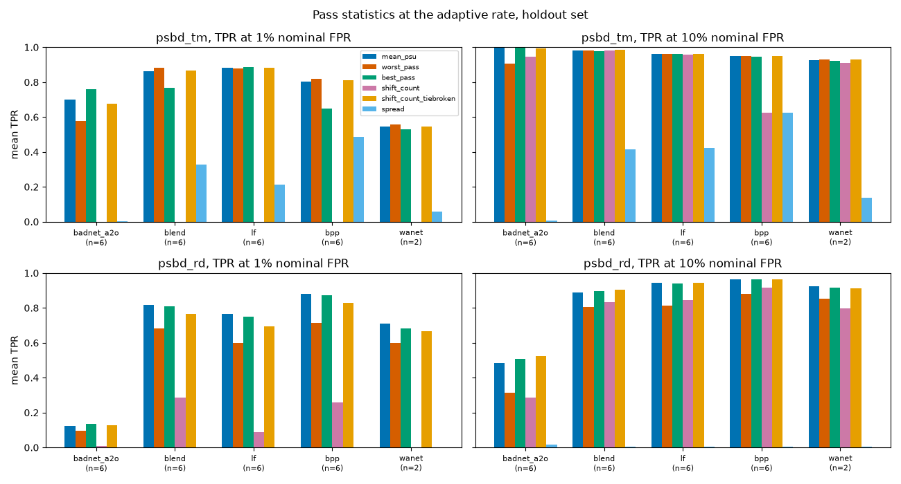
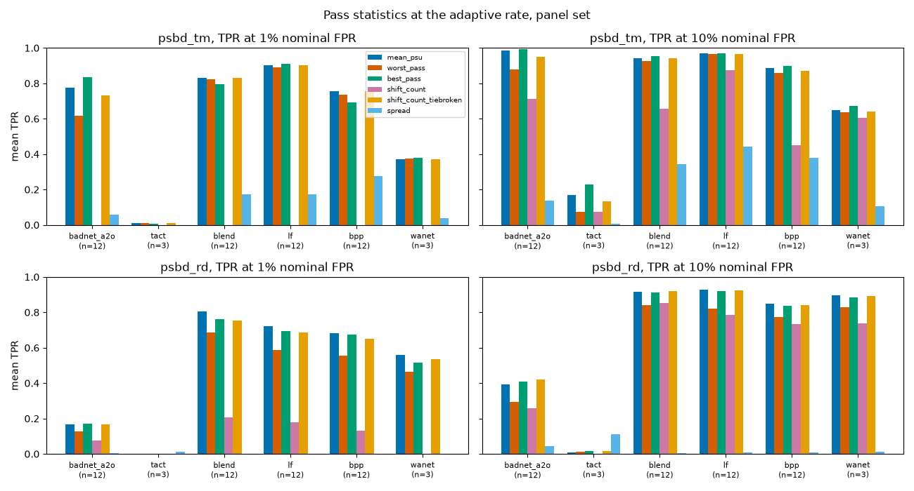
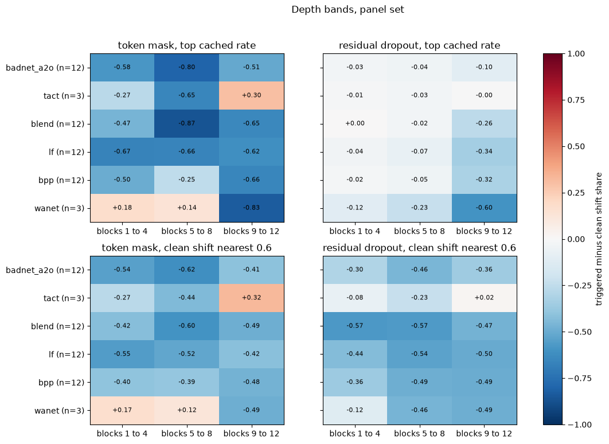
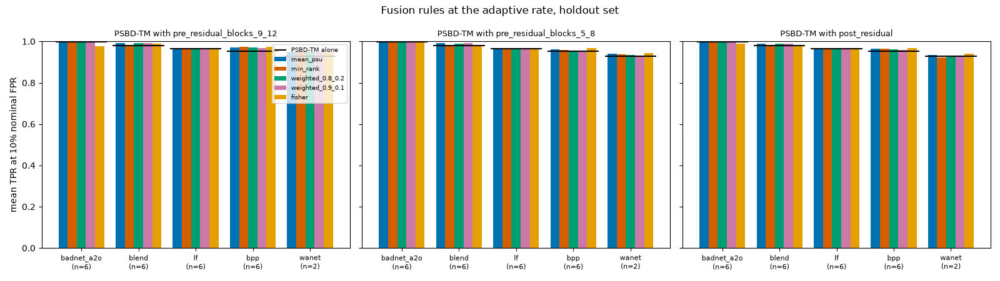
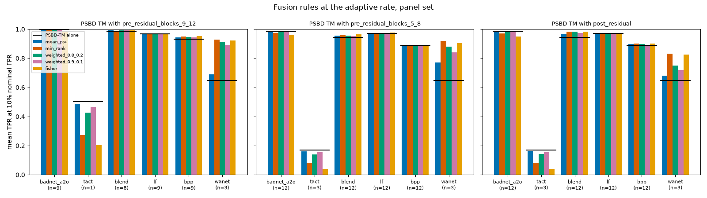

# Cache readouts of pass statistics, depth bands and fusion rules

3 questions of `docs/simple-experiments-plan.md` can be answered from the per-pass tensors `cli.sweep` already cached, with no GPU. X19 and N17 ask which statistic over PSBD's perturbed passes separates triggered from clean inputs best. X4 asks which depth band of token masking and of residual dropout breaks which trigger, which tests the routing (E1), redundancy (E2) and computed-trigger (E10) accounts. X3 asks which rule should fuse PSBD-TM with a residual-dropout partner, which decides how a WaNet specialist would enter a union. Every number below is written by a script in this directory into `results/_experiments/cache_readouts` and rendered by `render_readme.py`, which names the file and field in each table caption.

<!-- results:begin -->
<!-- Everything down to results:end is rendered from the records by render_readme.py on every run. -->

## Development set and protocol

The plan fixes 10 development models. 3 of them belong to CIFAR-100 and Tiny ImageNet, which `configs/psbd_basis.json` reserves for reporting, so exploring on them would spend the held-out half. `dev_set.json` swaps each for a CIFAR-10 or GTSRB model of the same attack that carries every placement X3 and X4 read, and `shared.load_model_set` refuses to run when a declared panel label disagrees with the ledger.

- `vit_tiny_wanet_0_05` is replaced by `vit_gtsrb_wanet_0_1`. The plan names it for this swap. It clears the ASR bar and fails only the 2-point clean-accuracy bar, so it is labeled and never pooled with panel models. `vit_cifar10_wanet_0_05` fails the same bar and lacks an adaptive rate for `pre_residual_blocks_9_12`, so it would drop out of X3.
- `vit_cifar100_bpp_0_01` is replaced by `vit_gtsrb_bpp_0_1`. The 3 remaining CIFAR-10 and GTSRB BPP panel models are `vit_cifar10_bpp_0_01`, `vit_cifar10_bpp_0_1` and `vit_gtsrb_bpp_0_05`. The CIFAR-10 ones have no adaptive rate for `pre_residual_blocks_9_12`. Of the 2 GTSRB ones the 10% model spans the rate range with the 1% and 5% members already in the set.
- `vit_tiny_lf_0_01` is replaced by `vit_gtsrb_lf_0_01`. It has the attack and rate of the replaced member. `vit_cifar10_lf_0_01` has no adaptive rate for `pre_residual_blocks_9_12`, while the GTSRB model carries every placement X3 and X4 read.

The development set therefore holds 10 models, 9 of them successful backdoors at the 2-point bar. `vit_gtsrb_wanet_0_1` fails only the clean-accuracy bar and stays in every per-model table under that label, never in a pooled mean. The table reads `pass_statistics_dev.json` (`models[].placements.*.statistics.mean_psu.auroc`) and `fusion_rules_dev.json` (`models[].partners.adaptive.late_band.rate`).

| model | role | replaces | successful_2pt | PSBD-TM rate | PSBD-TM AUROC | PSBD-RD AUROC | late band rate |
|---|---|---|---|---|---|---|---|
| `vit_cifar10_wanet_0_1` | the WaNet failure |  | yes | 0.5 | 0.459 | 0.947 | 0.99 |
| `vit_gtsrb_wanet_0_1` | second WaNet model, below the 2-point clean bar | `vit_tiny_wanet_0_05` | no | 0.4 | 0.948 | 0.960 | 0.95 |
| `vit_cifar10_bpp_0_05` | PSBD-TM's weakest non-WaNet model |  | yes | 0.7 | 0.801 | 0.880 | not reached |
| `vit_gtsrb_bpp_0_01` | BPP where PSBD-TM leads |  | yes | 0.6 | 0.898 | 0.755 | 0.99 |
| `vit_gtsrb_bpp_0_1` | BPP at the highest poison rate | `vit_cifar100_bpp_0_01` | yes | 0.6 | 0.989 | 0.977 | 0.99 |
| `vit_cifar10_blend_0_1` | Blend where PSBD-RD leads |  | yes | 0.6 | 0.906 | 0.991 | not reached |
| `vit_cifar10_badnet_a2o_0_01` | the patch contrast |  | yes | 0.8 | 0.982 | 0.309 | not reached |
| `vit_gtsrb_tact_0_05` | trigger-conditional TaCT |  | yes | 0.5 | 0.942 | 0.392 | 0.99 |
| `vit_cifar10_tact_0_01` | high AUROC with low TPR |  | yes | 0.8 | 0.979 | 0.464 | not reached |
| `vit_gtsrb_lf_0_01` | LF at the same poison rate as the member it replaces | `vit_tiny_lf_0_01` | yes | 0.5 | 0.976 | 0.987 | 0.99 |

The protocol follows steps 1 to 5 of the plan's design section. Every readout ran on the development set first as exploration. I then wrote `preregistration.json` at 2026-09-29T18:58:00Z, naming 1 pass statistic and 1 fusion rule with their predicted effects, before any script read another model. Only after that did the scripts read the 26 successful CIFAR-100 and Tiny ImageNet models once as the confirmation and then the 54 models of the full panel for completeness. The full panel contains the development models, so it is never read as confirmation. After that first read the held-out and panel readouts were rerun to add reporting fields (the union-bound threshold of the weighted rules and the cached ladder of partners that never reach the target) and to fix a figure label, with no change to any pick, statistic, rate rule or threshold. `judge.py` stores the SHA-256 of the pre-registration beside the verdicts (`verdicts_all.json`, `preregistration_sha256` = `9a8a7ce3d60188be4f287c21797ad6edea3c96d6132621bae897f93de66019b8`), so a later edit of the predictions would show.

## Method

Every score is read the way `cli.analyze` reads it. `defenses.cache` loads the tensors, `defenses.scores.psu_ratio_from_cache` gives fractional PSU, `defenses.scores.shift_ratio` gives the clean-validation shift at each cached rate and `defenses.decision.select_rate_adaptively` at 0.8 picks the rate. `defenses.decision.pair_clean_to_backdoor` restricts the clean test split to the triggered split's images, and `defenses.decision.detection_report` gives AUROC and TPR at a threshold set to a quantile of the clean-validation scores. The quantile is the nominal FPR and the FPR realized on the paired clean test split is reported beside every TPR. All scores are oriented so that a low score means poisoned. Paired differences carry a bootstrap 95% interval over models from `scripts.paper._common.bootstrap_ci` at 5000 resamples and seed 0.

The control is the headline statistic itself. The mean fractional PSU computed here must equal `detection_psu_ratio` of `psbd_metrics.json` at the same rate, and the adaptive rate must equal the stored one. It did on 20 of 20 model and placement pairs of the development set, 52 of 52 of the held-out set and 108 of 108 of the panel (`pass_statistics_<set>.json`, `control`), bit for bit.

The pass statistics of X19 start from the retained fraction of each pass. The paper's fractional PSU is the first line, the other 5 pool the same passes differently.

$$
r_j(x) = \frac{P_c(x;\,p,\,\theta_j')}{P_c(x;\,\theta)}, \qquad
\phi_{\mathrm{mean}} = 1 - \frac{1}{k}\sum_{j=1}^{k} r_j, \qquad
\phi_{\mathrm{worst}} = 1 - \min_j r_j, \qquad
\phi_{\mathrm{best}} = 1 - \max_j r_j
$$

$$
\phi_{\mathrm{count}} = \sum_{j=1}^{k} \mathbb{1}\big[\hat y_j(x) \ne c\big], \qquad
\phi_{\mathrm{count+}} = \phi_{\mathrm{count}} + \tfrac{1}{4}\,\mathrm{clip}(\phi_{\mathrm{mean}}, -1, 1), \qquad
\phi_{\mathrm{spread}} = \mathrm{std}_j\, r_j
$$

| symbol | meaning |
|---|---|
| $P_c(x;\,\theta)$ | unperturbed probability of the unperturbed argmax class $c$, clamped below at $10^{-6}$ as in `psu_ratio_from_cache` |
| $P_c(x;\,p,\,\theta_j')$ | the same class's probability on perturbed pass $j$ at rate $p$ |
| $r_j(x)$ | retained fraction on pass $j$ |
| $k$ | number of passes, 3 in every cache read here |
| $\hat y_j(x)$ | argmax on pass $j$ |
| $\phi_{\mathrm{count}}$ | number of passes that move the label |
| $\phi_{\mathrm{count+}}$ | the count with ties inside a count broken by the mean, which keeps the count's order |
| $\phi_{\mathrm{spread}}$ | population standard deviation of the retained fractions |

The sign of the spread was fixed before any triggered score was read. Under the OR account a triggered input keeps its label on every pass, so its passes agree and its spread is low.

X4 reads each band at its top cached rate, as the plan asks. The share of passes whose label moved is averaged over triggered inputs and over their paired clean images, and the heat map shows triggered minus clean. Residual dropout at the top rate moves at least 0.942 of clean predictions in blocks 1 to 4 and 5 to 8 on every attack of the panel, which leaves nothing to compare, so the same readings are also taken at the rate whose clean-validation shift is nearest 0.6 (`select_rate_at_matched_shift`). That second reading is a sensitivity check and never replaces the first. The plan states E1, E2 and E10 in words. `depth_bands.py` fixed these thresholds before the first band was read.

- E1a. Token masking in blocks 1 to 4 and 5 to 8 leaves triggered patch inputs alone (triggered share at most 0.1) and breaks clean ones (clean share above triggered by at least 0.2), on every BadNets and TaCT model.
- E1b. Token masking in blocks 9 to 12 hits triggered patch inputs too (triggered share at least 0.2).
- E2. No token-mask band moves a global trigger (triggered share at most 0.1 on every Blend, LF and BPP model and band).
- E10. Residual dropout in blocks 1 to 4 moves triggered WaNet more than triggered BadNets, read on triggered minus clean, on every WaNet model against the BadNets mean.

X3 pairs PSBD-TM with each partner. With $\hat F$ the empirical CDF of a probe's fractional PSU on the clean validation split, $u_i = \hat F_i(\phi_i(x))$ its percentile and $w$ PSBD-TM's share of the FPR budget, the 5 fused scores are these.

$$
s_{\mathrm{mean}} = \tfrac{1}{2}(\phi_{\mathrm{TM}} + \phi_{\mathrm{P}}), \qquad
s_{\min} = \min(u_{\mathrm{TM}}, u_{\mathrm{P}}), \qquad
s_{w} = \min\!\Big(\frac{u_{\mathrm{TM}}}{w}, \frac{u_{\mathrm{P}}}{1 - w}\Big), \qquad
s_{\mathrm{Fisher}} = \log \tilde u_{\mathrm{TM}} + \log \tilde u_{\mathrm{P}}
$$

| symbol | meaning |
|---|---|
| $\phi_{\mathrm{TM}}, \phi_{\mathrm{P}}$ | fractional PSU of PSBD-TM and of the partner, each at its own adaptive rate |
| $u_{\mathrm{TM}}, u_{\mathrm{P}}$ | share of the partner's own clean-validation scores below the score (`defenses.scores.to_rank`) |
| $w$ | PSBD-TM's budget share, 0.8 or 0.9 |
| $\tilde u$ | $(n u + 1)/(n + 1)$ with $n$ validation images, so the logarithm is finite |

Every fused score is thresholded at a quantile of its own clean-validation distribution. For the weighted rule the plan also defines the literal union-bound threshold $s_w \le \alpha$, which is reported beside the calibrated one. The partners are `pre_residual_blocks_9_12` (late band), `pre_residual_blocks_5_8` (middle band) and `post_residual` (PSBD-RD). A partner whose ladder never reaches the adaptive target is read a second time at the rate nearest the target, under the label `nearest`, so no model drops out silently.

## Commands and wall time

```bash
source .venv/bin/activate
export OMP_NUM_THREADS=4
for set in dev holdout panel; do
    python -m experiments.cache_readouts.pass_statistics --set $set
    python -m experiments.cache_readouts.depth_bands --set $set
    python -m experiments.cache_readouts.fusion_rules --set $set
done
python -m experiments.cache_readouts.judge
python -m experiments.cache_readouts.render_readme
```

The scripts run on the login-node CPU and read only the caches. Wall time is each script's own `wall_seconds`, without the Python start-up.

| script | development set (s) | held-out confirmation set (s) | full panel (s) |
|---|---|---|---|
| `pass_statistics.py` | 15 | 45 | 82 |
| `depth_bands.py` | 2 | 8 | 12 |
| `fusion_rules.py` | 48 | 150 | 267 |

## Pre-registered picks

The pass statistic picked on the development set is the best pass of PSBD-TM. It separated better than the mean on 8 of 9 development models, +0.016 [+0.003, +0.032] in AUROC and +0.032 [+0.002, +0.064] in TPR at 1% FPR, while the worst pass that N17 proposed separated worse on 8 of them (-0.098 [-0.192, -0.025]). The fusion rule picked is the weighted min-rank at shares 0.9 and 0.1 with the late band. On the development model where PSBD-TM inverts it lifted AUROC from 0.459 to 0.890 (min-rank reached 0.938) and lost less on TaCT than min-rank and Fisher. The predictions and their verdicts are in the verdict section, with the full text in `preregistration.json`.

## Pass statistics

The best-pass pick did not confirm. On the 26 held-out models the best pass reads -0.002 [-0.004, -0.001] in AUROC against the mean and -0.044 [-0.115, +0.023] in TPR at 1% FPR. The AUROC interval lies below 0. On the full panel it reads +0.003 [-0.000, +0.006]. The worst pass loses everywhere, -0.008 [-0.015, -0.002] on the held-out set and -0.024 [-0.045, -0.010] on the panel, so N17's premise that a triggered patch input survives every pass intact does not hold at the adaptive rate. The per-attack tables show why the development gain did not carry over. The best pass helps the patch trigger and hurts the global ones. On the 12 BadNets models of the panel it lifts PSBD-TM's TPR at 1% FPR from 0.776 to 0.833, while BPP falls from 0.757 to 0.694 and Blend from 0.829 to 0.794. The development set held 1 BadNets model and 3 BPP models, so it could not show that trade.

The 2 hard-label statistics carry no extra information. With 3 passes the shifted-pass count takes 4 values, so a quantile threshold lands on a tie and the count flags nothing at 1% FPR (mean TPR 0.000 on the development set). Breaking the ties with the mean gives back the mean's ranking to within -0.004 [-0.015, +0.002] in AUROC. The spread is inverted, with mean AUROC 0.276 on the development set and 0.454 on the panel under the pre-declared sign. Triggered inputs disagree across passes more than clean ones, since a clean input loses its label on almost every pass at the adaptive rate while a triggered input keeps it on some passes and loses it on others. That is the same fact that sinks the worst pass.

Each table lists the mean over models, the paired difference from the mean fractional PSU with its interval and how many models moved up and down, from `pass_statistics_<set>.json`, `summary.<placement>.all.<statistic>.<field>`.

**PSBD-TM on the held-out set.**

| statistic | AUROC | AUROC minus mean PSU | models up / down | TPR 1% | TPR 1% minus mean PSU | TPR 5% | TPR 10% | FPR 1% | FPR 5% | FPR 10% |
|---|---|---|---|---|---|---|---|---|---|---|
| mean fractional PSU | 0.978 | +0.000 [+0.000, +0.000] | 0 / 0 | 0.791 | +0.000 [+0.000, +0.000] | 0.946 | 0.970 | 0.011 | 0.051 | 0.100 |
| worst pass | 0.970 | -0.008 [-0.015, -0.002] | 5 / 21 | 0.771 | -0.020 [-0.056, +0.008] | 0.918 | 0.947 | 0.011 | 0.051 | 0.100 |
| best pass | 0.975 | -0.002 [-0.004, -0.001] | 8 / 18 | 0.747 | -0.044 [-0.115, +0.023] | 0.940 | 0.968 | 0.012 | 0.052 | 0.099 |
| shifted-pass count | 0.950 | -0.027 [-0.032, -0.023] | 0 / 26 | 0.000 | -0.791 [-0.873, -0.703] | 0.133 | 0.879 | 0.000 | 0.008 | 0.074 |
| shifted-pass count, tie broken | 0.977 | -0.001 [-0.002, +0.001] | 10 / 16 | 0.789 | -0.002 [-0.010, +0.005] | 0.935 | 0.970 | 0.011 | 0.051 | 0.099 |
| spread across passes | 0.485 | -0.493 [-0.616, -0.373] | 0 / 26 | 0.241 | -0.550 [-0.648, -0.448] | 0.317 | 0.350 | 0.010 | 0.048 | 0.097 |

**PSBD-RD on the held-out set.**

| statistic | AUROC | AUROC minus mean PSU | models up / down | TPR 1% | TPR 1% minus mean PSU | TPR 5% | TPR 10% | FPR 1% | FPR 5% | FPR 10% |
|---|---|---|---|---|---|---|---|---|---|---|
| mean fractional PSU | 0.930 | +0.000 [+0.000, +0.000] | 0 / 0 | 0.652 | +0.000 [+0.000, +0.000] | 0.775 | 0.829 | 0.010 | 0.050 | 0.100 |
| worst pass | 0.866 | -0.064 [-0.087, -0.044] | 0 / 26 | 0.529 | -0.124 [-0.152, -0.095] | 0.655 | 0.715 | 0.009 | 0.051 | 0.100 |
| best pass | 0.934 | +0.004 [-0.001, +0.011] | 6 / 20 | 0.646 | -0.007 [-0.014, +0.001] | 0.776 | 0.834 | 0.009 | 0.050 | 0.101 |
| shifted-pass count | 0.909 | -0.022 [-0.032, -0.008] | 1 / 25 | 0.148 | -0.504 [-0.653, -0.352] | 0.461 | 0.726 | 0.002 | 0.024 | 0.056 |
| shifted-pass count, tie broken | 0.931 | +0.001 [-0.003, +0.005] | 8 / 18 | 0.608 | -0.044 [-0.067, -0.022] | 0.743 | 0.840 | 0.010 | 0.050 | 0.100 |
| spread across passes | 0.093 | -0.838 [-0.900, -0.762] | 0 / 26 | 0.001 | -0.651 [-0.779, -0.510] | 0.003 | 0.007 | 0.010 | 0.048 | 0.100 |

**PSBD-TM on the full panel.**

| statistic | AUROC | AUROC minus mean PSU | models up / down | TPR 1% | TPR 1% minus mean PSU | TPR 5% | TPR 10% | FPR 1% | FPR 5% | FPR 10% |
|---|---|---|---|---|---|---|---|---|---|---|
| mean fractional PSU | 0.963 | +0.000 [+0.000, +0.000] | 0 / 0 | 0.747 | +0.000 [+0.000, +0.000] | 0.855 | 0.887 | 0.010 | 0.047 | 0.093 |
| worst pass | 0.939 | -0.024 [-0.045, -0.010] | 6 / 48 | 0.703 | -0.044 [-0.074, -0.020] | 0.808 | 0.844 | 0.010 | 0.047 | 0.092 |
| best pass | 0.965 | +0.003 [-0.000, +0.006] | 27 / 27 | 0.739 | -0.008 [-0.047, +0.025] | 0.866 | 0.898 | 0.011 | 0.047 | 0.093 |
| shifted-pass count | 0.914 | -0.049 [-0.075, -0.030] | 2 / 52 | 0.000 | -0.747 [-0.824, -0.667] | 0.101 | 0.636 | 0.000 | 0.005 | 0.055 |
| shifted-pass count, tie broken | 0.962 | -0.001 [-0.003, +0.000] | 20 / 34 | 0.738 | -0.009 [-0.021, -0.000] | 0.836 | 0.871 | 0.010 | 0.046 | 0.092 |
| spread across passes | 0.454 | -0.509 [-0.594, -0.424] | 0 / 54 | 0.154 | -0.593 [-0.668, -0.517] | 0.246 | 0.296 | 0.012 | 0.060 | 0.117 |

**PSBD-RD on the full panel.**

| statistic | AUROC | AUROC minus mean PSU | models up / down | TPR 1% | TPR 1% minus mean PSU | TPR 5% | TPR 10% | FPR 1% | FPR 5% | FPR 10% |
|---|---|---|---|---|---|---|---|---|---|---|
| mean fractional PSU | 0.885 | +0.000 [+0.000, +0.000] | 0 / 0 | 0.559 | +0.000 [+0.000, +0.000] | 0.680 | 0.736 | 0.010 | 0.046 | 0.092 |
| worst pass | 0.841 | -0.044 [-0.058, -0.032] | 3 / 51 | 0.460 | -0.099 [-0.118, -0.079] | 0.587 | 0.654 | 0.009 | 0.047 | 0.093 |
| best pass | 0.886 | +0.001 [-0.004, +0.007] | 11 / 43 | 0.540 | -0.019 [-0.029, -0.009] | 0.672 | 0.734 | 0.009 | 0.046 | 0.093 |
| shifted-pass count | 0.862 | -0.022 [-0.040, -0.005] | 5 / 49 | 0.131 | -0.428 [-0.529, -0.327] | 0.441 | 0.625 | 0.002 | 0.021 | 0.047 |
| shifted-pass count, tie broken | 0.885 | +0.000 [-0.002, +0.003] | 18 / 36 | 0.531 | -0.028 [-0.041, -0.014] | 0.662 | 0.740 | 0.009 | 0.046 | 0.093 |
| spread across passes | 0.157 | -0.727 [-0.809, -0.633] | 3 / 51 | 0.002 | -0.557 [-0.659, -0.453] | 0.011 | 0.022 | 0.011 | 0.051 | 0.103 |

**PSBD-TM on the development set.**

| statistic | AUROC | AUROC minus mean PSU | models up / down | TPR 1% | TPR 1% minus mean PSU | TPR 5% | TPR 10% | FPR 1% | FPR 5% | FPR 10% |
|---|---|---|---|---|---|---|---|---|---|---|
| mean fractional PSU | 0.881 | +0.000 [+0.000, +0.000] | 0 / 0 | 0.457 | +0.000 [+0.000, +0.000] | 0.545 | 0.612 | 0.009 | 0.042 | 0.083 |
| worst pass | 0.783 | -0.098 [-0.192, -0.025] | 1 / 8 | 0.384 | -0.073 [-0.170, -0.012] | 0.459 | 0.505 | 0.008 | 0.041 | 0.083 |
| best pass | 0.897 | +0.016 [+0.003, +0.032] | 8 / 1 | 0.489 | +0.032 [+0.002, +0.064] | 0.578 | 0.657 | 0.009 | 0.042 | 0.083 |
| shifted-pass count | 0.795 | -0.086 [-0.193, -0.009] | 2 / 7 | 0.000 | -0.457 [-0.686, -0.228] | 0.000 | 0.201 | 0.000 | 0.000 | 0.020 |
| shifted-pass count, tie broken | 0.877 | -0.004 [-0.015, +0.002] | 4 / 5 | 0.432 | -0.026 [-0.078, +0.003] | 0.498 | 0.545 | 0.009 | 0.042 | 0.082 |
| spread across passes | 0.276 | -0.605 [-0.804, -0.389] | 0 / 9 | 0.052 | -0.405 [-0.603, -0.212] | 0.109 | 0.140 | 0.013 | 0.078 | 0.149 |

**PSBD-RD on the development set.**

| statistic | AUROC | AUROC minus mean PSU | models up / down | TPR 1% | TPR 1% minus mean PSU | TPR 5% | TPR 10% | FPR 1% | FPR 5% | FPR 10% |
|---|---|---|---|---|---|---|---|---|---|---|
| mean fractional PSU | 0.745 | +0.000 [+0.000, +0.000] | 0 / 0 | 0.318 | +0.000 [+0.000, +0.000] | 0.445 | 0.512 | 0.008 | 0.038 | 0.076 |
| worst pass | 0.729 | -0.016 [-0.031, +0.000] | 2 / 7 | 0.282 | -0.037 [-0.059, -0.015] | 0.399 | 0.486 | 0.009 | 0.039 | 0.078 |
| best pass | 0.754 | +0.009 [-0.006, +0.025] | 4 / 5 | 0.297 | -0.021 [-0.058, +0.009] | 0.432 | 0.504 | 0.009 | 0.036 | 0.077 |
| shifted-pass count | 0.739 | -0.006 [-0.067, +0.046] | 3 / 6 | 0.166 | -0.152 [-0.279, -0.046] | 0.233 | 0.428 | 0.003 | 0.010 | 0.044 |
| shifted-pass count, tie broken | 0.745 | +0.001 [-0.006, +0.007] | 4 / 5 | 0.317 | -0.001 [-0.015, +0.014] | 0.436 | 0.509 | 0.008 | 0.037 | 0.080 |
| spread across passes | 0.280 | -0.465 [-0.739, -0.170] | 2 / 7 | 0.005 | -0.313 [-0.554, -0.094] | 0.025 | 0.049 | 0.010 | 0.053 | 0.107 |

**PSBD-TM per attack.**

Each cell is mean AUROC / mean TPR at 1% FPR (`summary.psbd_tm.by_attack.<attack>.<statistic>`).

**Held-out set.**

| attack (models) | mean fractional PSU | worst pass | best pass | shifted-pass count | shifted-pass count, tie broken | spread across passes |
|---|---|---|---|---|---|---|
| badnet_a2o (6) | 0.990 / 0.699 | 0.960 / 0.576 | 0.991 / 0.760 | 0.961 / 0.000 | 0.985 / 0.677 | 0.105 / 0.002 |
| blend (6) | 0.990 / 0.861 | 0.991 / 0.881 | 0.986 / 0.769 | 0.959 / 0.000 | 0.992 / 0.866 | 0.549 / 0.326 |
| lf (6) | 0.970 / 0.883 | 0.966 / 0.878 | 0.970 / 0.886 | 0.948 / 0.000 | 0.970 / 0.883 | 0.617 / 0.214 |
| bpp (6) | 0.974 / 0.805 | 0.973 / 0.820 | 0.968 / 0.647 | 0.939 / 0.000 | 0.975 / 0.811 | 0.725 / 0.486 |
| wanet (2) | 0.940 / 0.546 | 0.936 / 0.557 | 0.938 / 0.530 | 0.931 / 0.000 | 0.941 / 0.546 | 0.315 / 0.058 |

**Full panel.**

| attack (models) | mean fractional PSU | worst pass | best pass | shifted-pass count | shifted-pass count, tie broken | spread across passes |
|---|---|---|---|---|---|---|
| badnet_a2o (12) | 0.992 / 0.776 | 0.958 / 0.615 | 0.993 / 0.833 | 0.957 / 0.000 | 0.984 / 0.732 | 0.242 / 0.060 |
| tact (3) | 0.962 / 0.012 | 0.820 / 0.012 | 0.965 / 0.007 | 0.658 / 0.000 | 0.963 / 0.011 | 0.036 / 0.000 |
| blend (12) | 0.978 / 0.829 | 0.973 / 0.823 | 0.979 / 0.794 | 0.938 / 0.000 | 0.979 / 0.832 | 0.530 / 0.172 |
| lf (12) | 0.980 / 0.904 | 0.977 / 0.892 | 0.980 / 0.909 | 0.946 / 0.000 | 0.979 / 0.904 | 0.656 / 0.175 |
| bpp (12) | 0.948 / 0.757 | 0.929 / 0.735 | 0.951 / 0.694 | 0.907 / 0.000 | 0.949 / 0.757 | 0.530 / 0.276 |
| wanet (3) | 0.779 / 0.372 | 0.724 / 0.377 | 0.802 / 0.379 | 0.802 / 0.000 | 0.782 / 0.372 | 0.315 / 0.040 |

**Development set.**

| attack (models) | mean fractional PSU | worst pass | best pass | shifted-pass count | shifted-pass count, tie broken | spread across passes |
|---|---|---|---|---|---|---|
| badnet_a2o (1) | 0.982 / 0.851 | 0.813 / 0.422 | 0.991 / 0.951 | 0.885 / 0.000 | 0.937 / 0.620 | 0.020 / 0.000 |
| tact (2) | 0.960 / 0.017 | 0.749 / 0.018 | 0.965 / 0.010 | 0.722 / 0.000 | 0.961 / 0.016 | 0.033 / 0.000 |
| blend (1) | 0.906 / 0.550 | 0.879 / 0.491 | 0.917 / 0.596 | 0.849 / 0.000 | 0.908 / 0.563 | 0.158 / 0.001 |
| lf (1) | 0.976 / 0.854 | 0.970 / 0.839 | 0.979 / 0.879 | 0.925 / 0.000 | 0.975 / 0.853 | 0.707 / 0.068 |
| bpp (3) | 0.896 / 0.601 | 0.862 / 0.550 | 0.908 / 0.626 | 0.837 / 0.000 | 0.897 / 0.597 | 0.407 / 0.132 |
| wanet (1) | 0.459 / 0.023 | 0.301 / 0.016 | 0.529 / 0.078 | 0.545 / 0.000 | 0.465 / 0.022 | 0.314 / 0.004 |





## Depth bands

The patch trigger reading splits E1 in 2. Token masking in blocks 1 to 4 or 5 to 8 leaves triggered BadNets predictions where they were, 0.003 and 0.000 of passes moved against 0.585 and 0.799 of clean passes on the panel at the top rate 0.99. That part (E1a) held on all 12 BadNets models, and the panel models where it failed are `vit_cifar10_tact_0_01`. Token masking in blocks 9 to 12 moves 0.194 of triggered BadNets passes against 0.705 of clean ones, below the hit E1b predicted, which held on 7 of 15 patch models. The survival law of X9 with 4 trigger tokens read in 4 blocks predicts that a pass keeps the trigger only if 1 of its 16 reads is left, which at rate 0.99 breaks 0.851 of passes. The measured break is far smaller. At that rate nearly every patch token is hidden, so no clean evidence competes with what the class token already holds after block 8 either, which is a hypothesis this readout cannot separate from an early read of the trigger. TaCT inverts in the late band, 0.975 of triggered passes moved against 0.671 of clean ones.

WaNet reads the opposite way round. Token masking in blocks 1 to 4 moves 0.761 of triggered WaNet passes against 0.583 of clean ones and blocks 5 to 8 move 0.958 against 0.822, while blocks 9 to 12 move only 0.073 against 0.903. On each of the 3 WaNet models of the panel the middle band moves triggered predictions more than clean ones and the late band moves them less, which is what E10 expects of a trigger assembled from relations between tokens and points to the early and middle blocks as where token masking disturbs WaNet. The readout does not show that this causes the inverted cell, since the Tiny ImageNet WaNet models share the pattern and PSBD-TM still separates them (`vit_cifar10_wanet_0_1` 0.459, `vit_tiny_wanet_0_05` 0.930, `vit_tiny_wanet_0_1` 0.950 in `pass_statistics_panel.json`). E10 as the plan stated it, for residual dropout in blocks 1 to 4, failed at the top rate (WaNet -0.117 against BadNets -0.026, both saturated) and held at the matched reading (-0.121 against -0.303). With the 2 readings in disagreement the verdict is inconclusive. E2 failed in part. 32 of 108 global-trigger readings on the panel move triggered predictions above the bar, counted by attack and band as bpp in blocks 5 to 8 (10), bpp in blocks 1 to 4 (6), lf in blocks 5 to 8 (6), blend in blocks 1 to 4 (5), lf in blocks 1 to 4 (2), blend in blocks 5 to 8 (1), blend in blocks 9 to 12 (1), bpp in blocks 9 to 12 (1).

Each cell is triggered / clean share of passes whose label moved, from `depth_bands_<set>.json`, `summary.<reading>.by_attack.<attack>.<band>`. TM is token masking at the attention input and RD residual dropout before the add.

**Top cached rate, full panel.**

| attack (models) | TM 1 to 4 | TM 5 to 8 | TM 9 to 12 | RD 1 to 4 | RD 5 to 8 | RD 9 to 12 |
|---|---|---|---|---|---|---|
| badnet_a2o (12) | 0.003 / 0.585 | 0.000 / 0.799 | 0.194 / 0.705 | 0.940 / 0.966 | 0.924 / 0.965 | 0.799 / 0.903 |
| tact (3) | 0.098 / 0.366 | 0.311 / 0.963 | 0.975 / 0.671 | 0.928 / 0.942 | 0.928 / 0.953 | 0.870 / 0.871 |
| blend (12) | 0.181 / 0.646 | 0.015 / 0.880 | 0.011 / 0.658 | 0.965 / 0.964 | 0.939 / 0.963 | 0.636 / 0.900 |
| lf (12) | 0.058 / 0.728 | 0.182 / 0.841 | 0.022 / 0.638 | 0.929 / 0.966 | 0.892 / 0.966 | 0.554 / 0.897 |
| bpp (12) | 0.133 / 0.632 | 0.534 / 0.788 | 0.029 / 0.685 | 0.943 / 0.966 | 0.918 / 0.965 | 0.585 / 0.904 |
| wanet (3) | 0.761 / 0.583 | 0.958 / 0.822 | 0.073 / 0.903 | 0.853 / 0.969 | 0.741 / 0.972 | 0.341 / 0.936 |

**Clean shift nearest the matched target, full panel.**

| attack (models) | TM 1 to 4 | TM 5 to 8 | TM 9 to 12 | RD 1 to 4 | RD 5 to 8 | RD 9 to 12 |
|---|---|---|---|---|---|---|
| badnet_a2o (12) | 0.001 / 0.543 | 0.000 / 0.616 | 0.094 / 0.504 | 0.289 / 0.591 | 0.087 / 0.543 | 0.247 / 0.606 |
| tact (3) | 0.098 / 0.366 | 0.283 / 0.726 | 0.961 / 0.639 | 0.514 / 0.591 | 0.666 / 0.893 | 0.748 / 0.729 |
| blend (12) | 0.091 / 0.516 | 0.002 / 0.602 | 0.003 / 0.492 | 0.046 / 0.618 | 0.017 / 0.583 | 0.143 / 0.614 |
| lf (12) | 0.049 / 0.604 | 0.072 / 0.590 | 0.020 / 0.438 | 0.099 / 0.536 | 0.024 / 0.562 | 0.063 / 0.566 |
| bpp (12) | 0.110 / 0.513 | 0.207 / 0.594 | 0.026 / 0.502 | 0.204 / 0.567 | 0.063 / 0.550 | 0.108 / 0.603 |
| wanet (3) | 0.720 / 0.549 | 0.731 / 0.607 | 0.070 / 0.555 | 0.452 / 0.573 | 0.072 / 0.536 | 0.068 / 0.559 |

**Top cached rate, held-out set.**

| attack (models) | TM 1 to 4 | TM 5 to 8 | TM 9 to 12 | RD 1 to 4 | RD 5 to 8 | RD 9 to 12 |
|---|---|---|---|---|---|---|
| badnet_a2o (6) | 0.005 / 0.709 | 0.000 / 0.897 | 0.328 / 0.929 | 0.985 / 0.992 | 0.974 / 0.992 | 0.946 / 0.989 |
| blend (6) | 0.341 / 0.709 | 0.027 / 0.897 | 0.020 / 0.904 | 0.986 / 0.993 | 0.967 / 0.992 | 0.838 / 0.989 |
| lf (6) | 0.085 / 0.787 | 0.218 / 0.894 | 0.038 / 0.911 | 0.973 / 0.992 | 0.955 / 0.992 | 0.825 / 0.989 |
| bpp (6) | 0.170 / 0.665 | 0.598 / 0.877 | 0.030 / 0.950 | 0.975 / 0.992 | 0.957 / 0.992 | 0.809 / 0.989 |
| wanet (2) | 0.686 / 0.645 | 0.977 / 0.853 | 0.056 / 0.973 | 0.906 / 0.995 | 0.807 / 0.995 | 0.409 / 0.993 |

**Clean shift nearest the matched target, held-out set.**

| attack (models) | TM 1 to 4 | TM 5 to 8 | TM 9 to 12 | RD 1 to 4 | RD 5 to 8 | RD 9 to 12 |
|---|---|---|---|---|---|---|
| badnet_a2o (6) | 0.002 / 0.624 | 0.000 / 0.619 | 0.131 / 0.571 | 0.347 / 0.559 | 0.001 / 0.537 | 0.028 / 0.524 |
| blend (6) | 0.168 / 0.594 | 0.003 / 0.587 | 0.003 / 0.573 | 0.066 / 0.559 | 0.023 / 0.571 | 0.007 / 0.535 |
| lf (6) | 0.070 / 0.597 | 0.092 / 0.593 | 0.033 / 0.567 | 0.128 / 0.562 | 0.037 / 0.538 | 0.030 / 0.515 |
| bpp (6) | 0.150 / 0.599 | 0.132 / 0.573 | 0.023 / 0.585 | 0.086 / 0.548 | 0.025 / 0.522 | 0.022 / 0.528 |
| wanet (2) | 0.624 / 0.593 | 0.774 / 0.602 | 0.055 / 0.570 | 0.420 / 0.565 | 0.051 / 0.528 | 0.051 / 0.535 |

**Top cached rate, development set.**

| attack (models) | TM 1 to 4 | TM 5 to 8 | TM 9 to 12 | RD 1 to 4 | RD 5 to 8 | RD 9 to 12 |
|---|---|---|---|---|---|---|
| badnet_a2o (1) | 0.003 / 0.387 | 0.003 / 0.747 | 0.234 / 0.443 | 0.902 / 0.901 | 0.885 / 0.901 | 0.727 / 0.748 |
| tact (2) | 0.127 / 0.301 | 0.436 / 0.958 | 0.965 / 0.516 | 0.930 / 0.960 | 0.929 / 0.962 | 0.868 / 0.867 |
| blend (1) | 0.025 / 0.307 | 0.000 / 0.864 | 0.000 / 0.400 | 0.887 / 0.899 | 0.859 / 0.899 | 0.290 / 0.748 |
| lf (1) | 0.076 / 0.561 | 0.036 / 0.817 | 0.015 / 0.023 | 0.936 / 0.977 | 0.885 / 0.977 | 0.454 / 0.847 |
| bpp (3) | 0.121 / 0.690 | 0.619 / 0.717 | 0.049 / 0.452 | 0.940 / 0.949 | 0.916 / 0.947 | 0.424 / 0.835 |
| wanet (1) | 0.911 / 0.461 | 0.921 / 0.761 | 0.106 / 0.763 | 0.746 / 0.918 | 0.611 / 0.926 | 0.205 / 0.822 |

**Clean shift nearest the matched target, development set.**

| attack (models) | TM 1 to 4 | TM 5 to 8 | TM 9 to 12 | RD 1 to 4 | RD 5 to 8 | RD 9 to 12 |
|---|---|---|---|---|---|---|
| badnet_a2o (1) | 0.003 / 0.387 | 0.003 / 0.639 | 0.234 / 0.443 | 0.609 / 0.735 | 0.820 / 0.729 | 0.727 / 0.748 |
| tact (2) | 0.127 / 0.301 | 0.396 / 0.643 | 0.965 / 0.516 | 0.560 / 0.541 | 0.789 / 0.916 | 0.684 / 0.654 |
| blend (1) | 0.025 / 0.307 | 0.000 / 0.515 | 0.000 / 0.400 | 0.001 / 0.469 | 0.011 / 0.761 | 0.290 / 0.748 |
| lf (1) | 0.076 / 0.561 | 0.023 / 0.605 | 0.015 / 0.023 | 0.051 / 0.379 | 0.016 / 0.605 | 0.049 / 0.566 |
| bpp (3) | 0.071 / 0.455 | 0.337 / 0.626 | 0.049 / 0.452 | 0.382 / 0.565 | 0.148 / 0.437 | 0.230 / 0.627 |
| wanet (1) | 0.911 / 0.461 | 0.644 / 0.616 | 0.101 / 0.527 | 0.516 / 0.590 | 0.114 / 0.551 | 0.102 / 0.608 |



## Fusion rules

The fusion pick confirmed. On the 26 held-out models the weighted min-rank at 0.9 and 0.1 with the late band raises AUROC by +0.005 [+0.003, +0.008], TPR at 10% FPR by +0.008 [+0.003, +0.015] and TPR at 1% FPR by +0.065 [+0.017, +0.126]. Every interval excludes 0. The gain is small, as the pre-registration expected, since the held-out set holds no PSBD-TM failure and its lowest PSBD-TM AUROC is 0.921. The best rule on the held-out set by AUROC was the mean of fractional PSU (+0.007 [+0.004, +0.011]), which shows the selection optimism. On the full panel the pick reads +0.015 [+0.002, +0.038] in AUROC and +0.045 [+0.012, +0.089] in TPR at 1% FPR. It lifts the WaNet mean from 0.779 to 0.936. The union-bound threshold gives the same operating point as the calibrated one, 0.956 TPR at a realized 0.093 FPR for the nominal 10%.

The coverage gap comes from the band itself. 15 of 54 panel models never reach the adaptive target with late residual dropout, so the adaptive reading covers 39. The missing models are `vit_cifar10_badnet_a2o_0_01`, `vit_cifar10_badnet_a2o_0_05`, `vit_cifar10_badnet_a2o_0_1`, `vit_cifar10_blend_0_01`, `vit_cifar10_blend_0_05`, `vit_cifar10_blend_0_1`, `vit_cifar10_bpp_0_01`, `vit_cifar10_bpp_0_05`, `vit_cifar10_bpp_0_1`, `vit_cifar10_lf_0_01`, `vit_cifar10_lf_0_05`, `vit_cifar10_lf_0_1`, `vit_cifar10_tact_0_01`, `vit_cifar10_tact_0_05`, `vit_gtsrb_blend_0_05`. Each of them already holds the full 11-rate ladder up to 0.99 (`fusion_rules_panel.json`, `summary.adaptive.late_band.missing[].rates_cached`). Their largest clean-validation shift lies between 0.726 and 0.780. `docs/runs/2026-09-29-gpu-queue.md` item 1 says these models hold only the top 2 rates, which is what the run record of the last sweep lists, but the lower rates were cached earlier. Rerunning the ladder will not give them an adaptive rate. Read at the nearest rate, all 54 models are covered and the pick reads +0.014 [+0.003, +0.033]. That reading includes the 3 TaCT models, too few for an interval. Min-rank lowers their AUROC on 2 of them with a mean change of -0.191, and the pick lowers it on 2 with a mean change of -0.009, so the 0.9 share bounds the damage without removing it.

| set | rate rule | partner | models read | models missing |
|---|---|---|---|---|
| development set | adaptive | residual dropout, blocks 9 to 12 | 5 of 9 | 4 |
| development set | adaptive | residual dropout, blocks 5 to 8 | 9 of 9 | 0 |
| development set | adaptive | PSBD-RD | 9 of 9 | 0 |
| development set | nearest | residual dropout, blocks 9 to 12 | 9 of 9 | 0 |
| development set | nearest | residual dropout, blocks 5 to 8 | 9 of 9 | 0 |
| development set | nearest | PSBD-RD | 9 of 9 | 0 |
| held-out confirmation set | adaptive | residual dropout, blocks 9 to 12 | 26 of 26 | 0 |
| held-out confirmation set | adaptive | residual dropout, blocks 5 to 8 | 26 of 26 | 0 |
| held-out confirmation set | adaptive | PSBD-RD | 26 of 26 | 0 |
| held-out confirmation set | nearest | residual dropout, blocks 9 to 12 | 26 of 26 | 0 |
| held-out confirmation set | nearest | residual dropout, blocks 5 to 8 | 26 of 26 | 0 |
| held-out confirmation set | nearest | PSBD-RD | 26 of 26 | 0 |
| full panel | adaptive | residual dropout, blocks 9 to 12 | 39 of 54 | 15 |
| full panel | adaptive | residual dropout, blocks 5 to 8 | 54 of 54 | 0 |
| full panel | adaptive | PSBD-RD | 54 of 54 | 0 |
| full panel | nearest | residual dropout, blocks 9 to 12 | 54 of 54 | 0 |
| full panel | nearest | residual dropout, blocks 5 to 8 | 54 of 54 | 0 |
| full panel | nearest | PSBD-RD | 54 of 54 | 0 |

Each table reads `fusion_rules_<set>.json`, `summary.<rate rule>.<partner>.all.<rule>.<field>`, with the difference from PSBD-TM alone on the same models.

**Adaptive rate, held-out set.**

| partner | rule | models | AUROC | AUROC minus PSBD-TM | TPR 1% | TPR 10% | TPR 20% | FPR 1% | FPR 10% | FPR 20% |
|---|---|---|---|---|---|---|---|---|---|---|
| residual dropout, blocks 9 to 12 | PSBD-TM alone | 26 of 26 | 0.978 | +0.000 [+0.000, +0.000] | 0.791 | 0.970 | 0.980 | 0.011 | 0.100 | 0.200 |
| residual dropout, blocks 9 to 12 | mean of fractional PSU | 26 of 26 | 0.985 | +0.007 [+0.004, +0.011] | 0.855 | 0.979 | 0.983 | 0.011 | 0.100 | 0.200 |
| residual dropout, blocks 9 to 12 | min-rank | 26 of 26 | 0.985 | +0.007 [+0.002, +0.012] | 0.830 | 0.977 | 0.984 | 0.010 | 0.102 | 0.200 |
| residual dropout, blocks 9 to 12 | weighted min-rank 0.8 and 0.2 | 26 of 26 | 0.984 | +0.006 [+0.003, +0.009] | 0.861 | 0.979 | 0.983 | 0.010 | 0.099 | 0.200 |
| residual dropout, blocks 9 to 12 | weighted min-rank 0.9 and 0.1 | 26 of 26 | 0.983 | +0.005 [+0.003, +0.008] | 0.857 | 0.978 | 0.983 | 0.010 | 0.099 | 0.200 |
| residual dropout, blocks 9 to 12 | Fisher | 26 of 26 | 0.984 | +0.006 [-0.000, +0.012] | 0.855 | 0.974 | 0.983 | 0.010 | 0.101 | 0.199 |
| residual dropout, blocks 5 to 8 | PSBD-TM alone | 26 of 26 | 0.978 | +0.000 [+0.000, +0.000] | 0.791 | 0.970 | 0.980 | 0.011 | 0.100 | 0.200 |
| residual dropout, blocks 5 to 8 | mean of fractional PSU | 26 of 26 | 0.984 | +0.006 [+0.004, +0.008] | 0.874 | 0.976 | 0.982 | 0.011 | 0.102 | 0.203 |
| residual dropout, blocks 5 to 8 | min-rank | 26 of 26 | 0.983 | +0.005 [+0.002, +0.008] | 0.841 | 0.973 | 0.982 | 0.010 | 0.102 | 0.203 |
| residual dropout, blocks 5 to 8 | weighted min-rank 0.8 and 0.2 | 26 of 26 | 0.981 | +0.003 [+0.001, +0.005] | 0.824 | 0.974 | 0.982 | 0.011 | 0.100 | 0.200 |
| residual dropout, blocks 5 to 8 | weighted min-rank 0.9 and 0.1 | 26 of 26 | 0.980 | +0.002 [+0.001, +0.004] | 0.817 | 0.973 | 0.981 | 0.011 | 0.099 | 0.200 |
| residual dropout, blocks 5 to 8 | Fisher | 26 of 26 | 0.985 | +0.007 [+0.004, +0.010] | 0.895 | 0.976 | 0.982 | 0.010 | 0.102 | 0.202 |
| PSBD-RD | PSBD-TM alone | 26 of 26 | 0.978 | +0.000 [+0.000, +0.000] | 0.791 | 0.970 | 0.980 | 0.011 | 0.100 | 0.200 |
| PSBD-RD | mean of fractional PSU | 26 of 26 | 0.983 | +0.005 [+0.003, +0.008] | 0.833 | 0.975 | 0.982 | 0.011 | 0.100 | 0.203 |
| PSBD-RD | min-rank | 26 of 26 | 0.981 | +0.004 [+0.000, +0.007] | 0.768 | 0.973 | 0.982 | 0.009 | 0.101 | 0.200 |
| PSBD-RD | weighted min-rank 0.8 and 0.2 | 26 of 26 | 0.980 | +0.003 [+0.001, +0.005] | 0.796 | 0.974 | 0.982 | 0.010 | 0.098 | 0.200 |
| PSBD-RD | weighted min-rank 0.9 and 0.1 | 26 of 26 | 0.980 | +0.002 [+0.001, +0.004] | 0.803 | 0.973 | 0.981 | 0.011 | 0.098 | 0.199 |
| PSBD-RD | Fisher | 26 of 26 | 0.981 | +0.003 [-0.001, +0.008] | 0.777 | 0.972 | 0.981 | 0.010 | 0.101 | 0.199 |

**Adaptive rate, full panel.**

| partner | rule | models | AUROC | AUROC minus PSBD-TM | TPR 1% | TPR 10% | TPR 20% | FPR 1% | FPR 10% | FPR 20% |
|---|---|---|---|---|---|---|---|---|---|---|
| residual dropout, blocks 9 to 12 | PSBD-TM alone | 39 of 54 | 0.966 | +0.000 [+0.000, +0.000] | 0.789 | 0.933 | 0.957 | 0.010 | 0.097 | 0.195 |
| residual dropout, blocks 9 to 12 | mean of fractional PSU | 39 of 54 | 0.979 | +0.013 [+0.004, +0.029] | 0.833 | 0.941 | 0.966 | 0.010 | 0.097 | 0.195 |
| residual dropout, blocks 9 to 12 | min-rank | 39 of 54 | 0.983 | +0.017 [+0.003, +0.043] | 0.832 | 0.954 | 0.971 | 0.010 | 0.098 | 0.194 |
| residual dropout, blocks 9 to 12 | weighted min-rank 0.8 and 0.2 | 39 of 54 | 0.982 | +0.016 [+0.003, +0.041] | 0.842 | 0.958 | 0.974 | 0.010 | 0.097 | 0.194 |
| residual dropout, blocks 9 to 12 | weighted min-rank 0.9 and 0.1 | 39 of 54 | 0.981 | +0.015 [+0.002, +0.038] | 0.834 | 0.956 | 0.974 | 0.010 | 0.096 | 0.195 |
| residual dropout, blocks 9 to 12 | Fisher | 39 of 54 | 0.982 | +0.016 [+0.002, +0.043] | 0.841 | 0.951 | 0.970 | 0.010 | 0.098 | 0.194 |
| residual dropout, blocks 5 to 8 | PSBD-TM alone | 54 of 54 | 0.963 | +0.000 [+0.000, +0.000] | 0.747 | 0.887 | 0.916 | 0.010 | 0.093 | 0.186 |
| residual dropout, blocks 5 to 8 | mean of fractional PSU | 54 of 54 | 0.973 | +0.010 [+0.001, +0.027] | 0.764 | 0.896 | 0.928 | 0.010 | 0.094 | 0.187 |
| residual dropout, blocks 5 to 8 | min-rank | 54 of 54 | 0.974 | +0.011 [-0.001, +0.031] | 0.754 | 0.899 | 0.926 | 0.010 | 0.092 | 0.185 |
| residual dropout, blocks 5 to 8 | weighted min-rank 0.8 and 0.2 | 54 of 54 | 0.974 | +0.011 [+0.002, +0.029] | 0.762 | 0.902 | 0.929 | 0.010 | 0.092 | 0.185 |
| residual dropout, blocks 5 to 8 | weighted min-rank 0.9 and 0.1 | 54 of 54 | 0.972 | +0.009 [+0.001, +0.025] | 0.760 | 0.900 | 0.927 | 0.010 | 0.092 | 0.186 |
| residual dropout, blocks 5 to 8 | Fisher | 54 of 54 | 0.975 | +0.012 [+0.000, +0.031] | 0.761 | 0.894 | 0.920 | 0.010 | 0.092 | 0.185 |
| PSBD-RD | PSBD-TM alone | 54 of 54 | 0.963 | +0.000 [+0.000, +0.000] | 0.747 | 0.887 | 0.916 | 0.010 | 0.093 | 0.186 |
| PSBD-RD | mean of fractional PSU | 54 of 54 | 0.972 | +0.009 [+0.001, +0.021] | 0.758 | 0.895 | 0.926 | 0.010 | 0.093 | 0.188 |
| PSBD-RD | min-rank | 54 of 54 | 0.971 | +0.008 [-0.009, +0.029] | 0.735 | 0.901 | 0.929 | 0.009 | 0.092 | 0.185 |
| PSBD-RD | weighted min-rank 0.8 and 0.2 | 54 of 54 | 0.974 | +0.011 [+0.002, +0.025] | 0.749 | 0.901 | 0.928 | 0.010 | 0.092 | 0.186 |
| PSBD-RD | weighted min-rank 0.9 and 0.1 | 54 of 54 | 0.970 | +0.007 [+0.001, +0.018] | 0.753 | 0.898 | 0.925 | 0.010 | 0.092 | 0.186 |
| PSBD-RD | Fisher | 54 of 54 | 0.971 | +0.008 [-0.006, +0.027] | 0.709 | 0.894 | 0.921 | 0.010 | 0.093 | 0.185 |

**Nearest rate, full panel.**

| partner | rule | models | AUROC | AUROC minus PSBD-TM | TPR 1% | TPR 10% | TPR 20% | FPR 1% | FPR 10% | FPR 20% |
|---|---|---|---|---|---|---|---|---|---|---|
| residual dropout, blocks 9 to 12 | PSBD-TM alone | 54 of 54 | 0.963 | +0.000 [+0.000, +0.000] | 0.747 | 0.887 | 0.916 | 0.010 | 0.093 | 0.186 |
| residual dropout, blocks 9 to 12 | mean of fractional PSU | 54 of 54 | 0.971 | +0.008 [-0.005, +0.023] | 0.780 | 0.899 | 0.928 | 0.010 | 0.092 | 0.186 |
| residual dropout, blocks 9 to 12 | min-rank | 54 of 54 | 0.970 | +0.007 [-0.016, +0.032] | 0.765 | 0.911 | 0.934 | 0.009 | 0.094 | 0.187 |
| residual dropout, blocks 9 to 12 | weighted min-rank 0.8 and 0.2 | 54 of 54 | 0.978 | +0.015 [+0.002, +0.035] | 0.776 | 0.914 | 0.936 | 0.010 | 0.093 | 0.187 |
| residual dropout, blocks 9 to 12 | weighted min-rank 0.9 and 0.1 | 54 of 54 | 0.977 | +0.014 [+0.003, +0.033] | 0.782 | 0.912 | 0.935 | 0.010 | 0.092 | 0.187 |
| residual dropout, blocks 9 to 12 | Fisher | 54 of 54 | 0.972 | +0.009 [-0.012, +0.032] | 0.775 | 0.910 | 0.933 | 0.010 | 0.094 | 0.187 |
| residual dropout, blocks 5 to 8 | PSBD-TM alone | 54 of 54 | 0.963 | +0.000 [+0.000, +0.000] | 0.747 | 0.887 | 0.916 | 0.010 | 0.093 | 0.186 |
| residual dropout, blocks 5 to 8 | mean of fractional PSU | 54 of 54 | 0.974 | +0.011 [+0.001, +0.028] | 0.762 | 0.895 | 0.929 | 0.010 | 0.095 | 0.188 |
| residual dropout, blocks 5 to 8 | min-rank | 54 of 54 | 0.975 | +0.012 [-0.001, +0.032] | 0.755 | 0.902 | 0.928 | 0.010 | 0.092 | 0.186 |
| residual dropout, blocks 5 to 8 | weighted min-rank 0.8 and 0.2 | 54 of 54 | 0.974 | +0.011 [+0.001, +0.030] | 0.755 | 0.905 | 0.931 | 0.010 | 0.092 | 0.186 |
| residual dropout, blocks 5 to 8 | weighted min-rank 0.9 and 0.1 | 54 of 54 | 0.973 | +0.010 [+0.001, +0.027] | 0.750 | 0.903 | 0.929 | 0.010 | 0.092 | 0.186 |
| residual dropout, blocks 5 to 8 | Fisher | 54 of 54 | 0.976 | +0.013 [+0.001, +0.032] | 0.755 | 0.898 | 0.924 | 0.010 | 0.092 | 0.185 |
| PSBD-RD | PSBD-TM alone | 54 of 54 | 0.963 | +0.000 [+0.000, +0.000] | 0.747 | 0.887 | 0.916 | 0.010 | 0.093 | 0.186 |
| PSBD-RD | mean of fractional PSU | 54 of 54 | 0.971 | +0.008 [+0.001, +0.020] | 0.751 | 0.894 | 0.925 | 0.010 | 0.093 | 0.187 |
| PSBD-RD | min-rank | 54 of 54 | 0.970 | +0.007 [-0.009, +0.027] | 0.727 | 0.900 | 0.928 | 0.009 | 0.093 | 0.186 |
| PSBD-RD | weighted min-rank 0.8 and 0.2 | 54 of 54 | 0.973 | +0.010 [+0.001, +0.023] | 0.745 | 0.902 | 0.929 | 0.009 | 0.092 | 0.186 |
| PSBD-RD | weighted min-rank 0.9 and 0.1 | 54 of 54 | 0.970 | +0.007 [+0.001, +0.017] | 0.751 | 0.899 | 0.925 | 0.010 | 0.092 | 0.186 |
| PSBD-RD | Fisher | 54 of 54 | 0.970 | +0.007 [-0.006, +0.025] | 0.705 | 0.893 | 0.920 | 0.009 | 0.093 | 0.186 |

**Adaptive rate, development set.**

| partner | rule | models | AUROC | AUROC minus PSBD-TM | TPR 1% | TPR 10% | TPR 20% | FPR 1% | FPR 10% | FPR 20% |
|---|---|---|---|---|---|---|---|---|---|---|
| residual dropout, blocks 9 to 12 | PSBD-TM alone | 5 of 9 | 0.853 | +0.000 [+0.000, +0.000] | 0.462 | 0.641 | 0.771 | 0.008 | 0.081 | 0.166 |
| residual dropout, blocks 9 to 12 | mean of fractional PSU | 5 of 9 | 0.914 | +0.062 [+0.003, +0.175] | 0.468 | 0.657 | 0.828 | 0.009 | 0.082 | 0.165 |
| residual dropout, blocks 9 to 12 | min-rank | 5 of 9 | 0.951 | +0.099 [+0.002, +0.289] | 0.596 | 0.763 | 0.860 | 0.009 | 0.080 | 0.162 |
| residual dropout, blocks 9 to 12 | weighted min-rank 0.8 and 0.2 | 5 of 9 | 0.948 | +0.095 [+0.004, +0.278] | 0.511 | 0.786 | 0.888 | 0.008 | 0.081 | 0.160 |
| residual dropout, blocks 9 to 12 | weighted min-rank 0.9 and 0.1 | 5 of 9 | 0.942 | +0.089 [+0.003, +0.261] | 0.476 | 0.779 | 0.891 | 0.008 | 0.081 | 0.164 |
| residual dropout, blocks 9 to 12 | Fisher | 5 of 9 | 0.950 | +0.097 [-0.001, +0.284] | 0.525 | 0.757 | 0.856 | 0.009 | 0.082 | 0.162 |
| residual dropout, blocks 5 to 8 | PSBD-TM alone | 9 of 9 | 0.881 | +0.000 [+0.000, +0.000] | 0.457 | 0.612 | 0.705 | 0.009 | 0.083 | 0.167 |
| residual dropout, blocks 5 to 8 | mean of fractional PSU | 9 of 9 | 0.924 | +0.042 [-0.012, +0.135] | 0.419 | 0.644 | 0.770 | 0.010 | 0.083 | 0.162 |
| residual dropout, blocks 5 to 8 | min-rank | 9 of 9 | 0.931 | +0.050 [-0.021, +0.165] | 0.507 | 0.682 | 0.756 | 0.009 | 0.076 | 0.156 |
| residual dropout, blocks 5 to 8 | weighted min-rank 0.8 and 0.2 | 9 of 9 | 0.937 | +0.056 [+0.001, +0.157] | 0.492 | 0.690 | 0.775 | 0.009 | 0.079 | 0.163 |
| residual dropout, blocks 5 to 8 | weighted min-rank 0.9 and 0.1 | 9 of 9 | 0.931 | +0.049 [+0.001, +0.141] | 0.468 | 0.680 | 0.768 | 0.009 | 0.081 | 0.165 |
| residual dropout, blocks 5 to 8 | Fisher | 9 of 9 | 0.930 | +0.049 [-0.017, +0.159] | 0.451 | 0.650 | 0.726 | 0.010 | 0.079 | 0.161 |
| PSBD-RD | PSBD-TM alone | 9 of 9 | 0.881 | +0.000 [+0.000, +0.000] | 0.457 | 0.612 | 0.705 | 0.009 | 0.083 | 0.167 |
| PSBD-RD | mean of fractional PSU | 9 of 9 | 0.919 | +0.038 [-0.004, +0.106] | 0.440 | 0.634 | 0.748 | 0.009 | 0.085 | 0.167 |
| PSBD-RD | min-rank | 9 of 9 | 0.916 | +0.034 [-0.063, +0.159] | 0.492 | 0.674 | 0.766 | 0.008 | 0.077 | 0.158 |
| PSBD-RD | weighted min-rank 0.8 and 0.2 | 9 of 9 | 0.929 | +0.048 [-0.000, +0.128] | 0.473 | 0.664 | 0.757 | 0.009 | 0.081 | 0.164 |
| PSBD-RD | weighted min-rank 0.9 and 0.1 | 9 of 9 | 0.914 | +0.033 [-0.000, +0.088] | 0.459 | 0.650 | 0.742 | 0.009 | 0.081 | 0.166 |
| PSBD-RD | Fisher | 9 of 9 | 0.919 | +0.038 [-0.040, +0.148] | 0.412 | 0.648 | 0.733 | 0.008 | 0.082 | 0.160 |

**Late band per attack.**

Each cell is mean AUROC / mean TPR at 10% FPR (`summary.<rate rule>.late_band.by_attack`).

**Held-out set, adaptive rate.**

| attack (models) | PSBD-TM alone | mean of fractional PSU | min-rank | weighted min-rank 0.8 and 0.2 | weighted min-rank 0.9 and 0.1 | Fisher |
|---|---|---|---|---|---|---|
| badnet_a2o (6) | 0.990 / 0.998 | 0.991 / 0.998 | 0.984 / 0.994 | 0.989 / 0.997 | 0.990 / 0.998 | 0.980 / 0.976 |
| blend (6) | 0.990 / 0.980 | 0.995 / 0.992 | 0.994 / 0.984 | 0.995 / 0.991 | 0.995 / 0.992 | 0.995 / 0.988 |
| lf (6) | 0.970 / 0.963 | 0.978 / 0.964 | 0.981 / 0.966 | 0.975 / 0.965 | 0.974 / 0.965 | 0.980 / 0.965 |
| bpp (6) | 0.974 / 0.952 | 0.983 / 0.970 | 0.985 / 0.973 | 0.983 / 0.971 | 0.981 / 0.968 | 0.986 / 0.975 |
| wanet (2) | 0.940 / 0.928 | 0.967 / 0.949 | 0.968 / 0.950 | 0.961 / 0.949 | 0.958 / 0.949 | 0.966 / 0.948 |

**Full panel, adaptive rate.**

| attack (models) | PSBD-TM alone | mean of fractional PSU | min-rank | weighted min-rank 0.8 and 0.2 | weighted min-rank 0.9 and 0.1 | Fisher |
|---|---|---|---|---|---|---|
| badnet_a2o (9) | 0.993 / 0.998 | 0.994 / 0.998 | 0.989 / 0.996 | 0.992 / 0.998 | 0.993 / 0.998 | 0.986 / 0.984 |
| tact (1) | 0.942 / 0.502 | 0.953 / 0.488 | 0.946 / 0.271 | 0.947 / 0.428 | 0.945 / 0.466 | 0.933 / 0.202 |
| blend (8) | 0.993 / 0.985 | 0.996 / 0.994 | 0.995 / 0.988 | 0.996 / 0.993 | 0.996 / 0.994 | 0.996 / 0.991 |
| lf (9) | 0.977 / 0.967 | 0.982 / 0.968 | 0.984 / 0.971 | 0.981 / 0.969 | 0.980 / 0.969 | 0.984 / 0.972 |
| bpp (9) | 0.969 / 0.931 | 0.976 / 0.944 | 0.977 / 0.949 | 0.976 / 0.947 | 0.975 / 0.944 | 0.980 / 0.954 |
| wanet (3) | 0.779 / 0.647 | 0.893 / 0.689 | 0.958 / 0.929 | 0.947 / 0.914 | 0.936 / 0.893 | 0.953 / 0.922 |

**Full panel, nearest rate.**

| attack (models) | PSBD-TM alone | mean of fractional PSU | min-rank | weighted min-rank 0.8 and 0.2 | weighted min-rank 0.9 and 0.1 | Fisher |
|---|---|---|---|---|---|---|
| badnet_a2o (12) | 0.992 / 0.987 | 0.992 / 0.984 | 0.987 / 0.968 | 0.991 / 0.981 | 0.992 / 0.984 | 0.983 / 0.956 |
| tact (3) | 0.962 / 0.169 | 0.876 / 0.165 | 0.772 / 0.094 | 0.941 / 0.145 | 0.954 / 0.157 | 0.806 / 0.070 |
| blend (12) | 0.978 / 0.943 | 0.985 / 0.959 | 0.983 / 0.955 | 0.984 / 0.956 | 0.983 / 0.954 | 0.987 / 0.966 |
| lf (12) | 0.980 / 0.970 | 0.985 / 0.972 | 0.985 / 0.972 | 0.983 / 0.971 | 0.982 / 0.971 | 0.986 / 0.975 |
| bpp (12) | 0.948 / 0.888 | 0.966 / 0.916 | 0.976 / 0.946 | 0.972 / 0.938 | 0.969 / 0.930 | 0.978 / 0.949 |
| wanet (3) | 0.779 / 0.647 | 0.893 / 0.689 | 0.958 / 0.929 | 0.947 / 0.914 | 0.936 / 0.893 | 0.953 / 0.922 |

**Development set, adaptive rate.**

| attack (models) | PSBD-TM alone | mean of fractional PSU | min-rank | weighted min-rank 0.8 and 0.2 | weighted min-rank 0.9 and 0.1 | Fisher |
|---|---|---|---|---|---|---|
| tact (1) | 0.942 / 0.502 | 0.953 / 0.488 | 0.946 / 0.271 | 0.947 / 0.428 | 0.945 / 0.466 | 0.933 / 0.202 |
| lf (1) | 0.976 / 0.926 | 0.978 / 0.930 | 0.979 / 0.944 | 0.979 / 0.937 | 0.978 / 0.938 | 0.983 / 0.960 |
| bpp (2) | 0.943 / 0.844 | 0.947 / 0.850 | 0.947 / 0.857 | 0.949 / 0.860 | 0.947 / 0.856 | 0.953 / 0.877 |
| wanet (1) | 0.459 / 0.087 | 0.745 / 0.168 | 0.938 / 0.886 | 0.918 / 0.843 | 0.890 / 0.780 | 0.927 / 0.869 |

**Union-bound threshold of the weighted rules, full panel.**

| rule | nominal FPR | TPR, calibrated | FPR, calibrated | TPR, union bound | validation FPR, union bound | FPR, union bound |
|---|---|---|---|---|---|---|
| weighted min-rank 0.8 and 0.2 | 0.01 | 0.842 | 0.010 | 0.842 | 0.010 | 0.010 |
| weighted min-rank 0.8 and 0.2 | 0.10 | 0.958 | 0.097 | 0.957 | 0.095 | 0.092 |
| weighted min-rank 0.8 and 0.2 | 0.20 | 0.974 | 0.194 | 0.973 | 0.184 | 0.178 |
| weighted min-rank 0.9 and 0.1 | 0.01 | 0.834 | 0.010 | 0.837 | 0.010 | 0.010 |
| weighted min-rank 0.9 and 0.1 | 0.10 | 0.956 | 0.096 | 0.956 | 0.097 | 0.093 |
| weighted min-rank 0.9 and 0.1 | 0.20 | 0.974 | 0.195 | 0.973 | 0.190 | 0.185 |





## Verdicts

The pre-registered predictions are judged by `judge.py` from the stored paired summaries. A mean gain whose interval includes 0 is inconclusive under the tie rule, and a per-attack prediction on an attack the set does not contain is inconclusive. The held-out set holds no TaCT model, since every CIFAR-100 and Tiny ImageNet TaCT cell is source-mapped, so X3-patch could only be judged on the panel.

| prediction | set | models | mean paired difference | verdict |
|---|---|---|---|---|
| X19-best-auroc | held-out confirmation set | 26 | -0.002 [-0.004, -0.001] | failed |
| X19-best-tpr1 | held-out confirmation set | 26 | -0.044 [-0.115, +0.023] | failed |
| X19-worst-auroc | held-out confirmation set | 26 | -0.008 [-0.015, -0.002] | held |
| X3-auroc | held-out confirmation set | 26 | +0.005 [+0.003, +0.008] | held |
| X3-tpr10 | held-out confirmation set | 26 | +0.008 [+0.003, +0.015] | held |
| X3-tpr1 | held-out confirmation set | 26 | +0.065 [+0.017, +0.126] | held |
| X3-patch | held-out confirmation set | 26 | badnet_a2o +0.000 | inconclusive |
| X19-best-auroc | full panel | 54 | +0.003 [-0.000, +0.006] | inconclusive |
| X19-best-tpr1 | full panel | 54 | -0.008 [-0.047, +0.025] | failed |
| X19-worst-auroc | full panel | 54 | -0.024 [-0.045, -0.010] | held |
| X3-auroc | full panel | 39 | +0.015 [+0.002, +0.038] | held |
| X3-tpr10 | full panel | 39 | +0.023 [+0.002, +0.061] | held |
| X3-tpr1 | full panel | 39 | +0.045 [+0.012, +0.089] | held |
| X3-patch | full panel | 39 | badnet_a2o -0.000, tact +0.003 | held |
| X19-best-auroc | development set | 9 | +0.016 [+0.003, +0.032] | held |
| X19-best-tpr1 | development set | 9 | +0.032 [+0.002, +0.064] | held |
| X19-worst-auroc | development set | 9 | -0.098 [-0.192, -0.025] | held |
| X3-auroc | development set | 5 | +0.089 [+0.003, +0.261] | held |
| X3-tpr10 | development set | 5 | +0.138 [-0.017, +0.421] | held |
| X3-tpr1 | development set | 5 | +0.014 [-0.002, +0.037] | held |
| X3-patch | development set | 5 | tact +0.003 | inconclusive |

The plan's own predictions are judged the same way (`verdicts_all.json`, `sets.<set>.plan_*`). For X3 the plan predicted that the late band helps WaNet and Blend and hurts TaCT under the mean and min-rank rules, and that the weighted rules keep TaCT within 0.01 of AUROC and of TPR at 10% FPR while keeping at least 0.5 of the min-rank WaNet gain. A universal prediction broken on some checks is counted as failed in part, with the count of checks that held.

| prediction | set | reading | checks held | verdict |
|---|---|---|---|---|
| N17 and X19 | held-out confirmation set | adaptive | 0 of 1 | failed |
| X3 | held-out confirmation set | adaptive | 6 of 6, 4 undecidable | held |
| X3 | held-out confirmation set | nearest | 6 of 6, 4 undecidable | held |
| X4 E1a | held-out confirmation set | top_rate held, matched held |  | held |
| X4 E1b | held-out confirmation set | top_rate failed in part, matched failed in part |  | failed in part |
| X4 E2 | held-out confirmation set | top_rate failed in part, matched failed in part |  | failed in part |
| X4 E10 | held-out confirmation set | top_rate failed, matched failed in part |  | failed in part |
| N17 and X19 | full panel | adaptive | 0 of 2 | failed |
| X3 | full panel | adaptive | 6 of 10 | failed in part |
| X3 | full panel | nearest | 8 of 10 | failed in part |
| X4 E1a | full panel | top_rate failed in part, matched failed in part |  | failed in part |
| X4 E1b | full panel | top_rate failed in part, matched failed in part |  | failed in part |
| X4 E2 | full panel | top_rate failed in part, matched failed in part |  | failed in part |
| X4 E10 | full panel | top_rate failed, matched held |  | inconclusive, the 2 readings disagree |
| N17 and X19 | development set | adaptive | 0 of 2 | failed |
| X3 | development set | adaptive | 4 of 8, 2 undecidable | failed in part |
| X3 | development set | nearest | 8 of 10 | failed in part |
| X4 E1a | development set | top_rate failed in part, matched failed in part |  | failed in part |
| X4 E1b | development set | top_rate held, matched held |  | held |
| X4 E2 | development set | top_rate failed in part, matched failed in part |  | failed in part |
| X4 E10 | development set | top_rate failed, matched failed in part |  | failed in part |

## Consequences for the WaNet specialist and the union

The union should stay a budget-weighted minimum over the mean fractional PSU of each member. The weighted min-rank at 0.9 and 0.1 confirmed on held-out data and held its realized FPR at the nominal budget, and the pass statistics offer no replacement for the mean, since the best pass trades patch triggers against global ones and the worst pass and the spread lose outright. A per-attack statistic would need the defender to know the attack, so the best pass stays a finding about patch triggers and not a detector choice.

X4 shows that token masking in the early and middle blocks moves triggered WaNet predictions, while late token masking and late residual dropout leave them in place. That makes a late member the natural PSBD-sign partner for WaNet, and the late residual band already lifts the failing model in the union. The WaNet specialist of the plan has the opposite sign, so it has to beat this union on the WaNet models to earn a budget share, and it should be judged against PSBD-TM fused with the late band rather than against PSBD-TM alone. The same union costs TaCT in the late band, where triggered TaCT inputs move more than clean ones, so any late member needs the small budget share the pick uses. A token mask restricted to blocks 9 to 12 as a union member is a hypothesis these readings suggest and do not test, since its TaCT inversion is the same risk.

<!-- results:end -->
