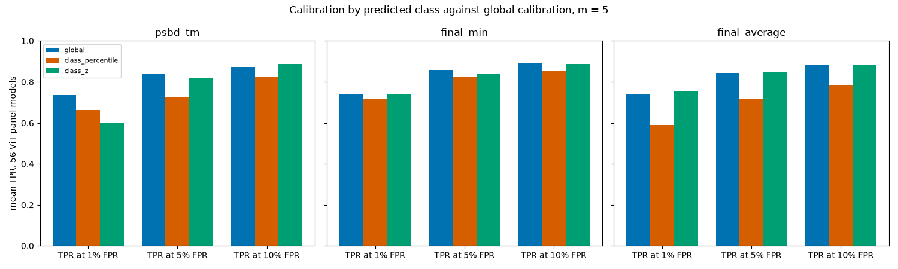
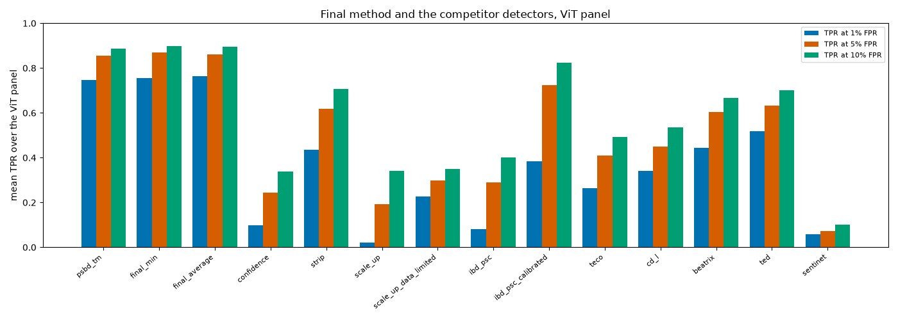
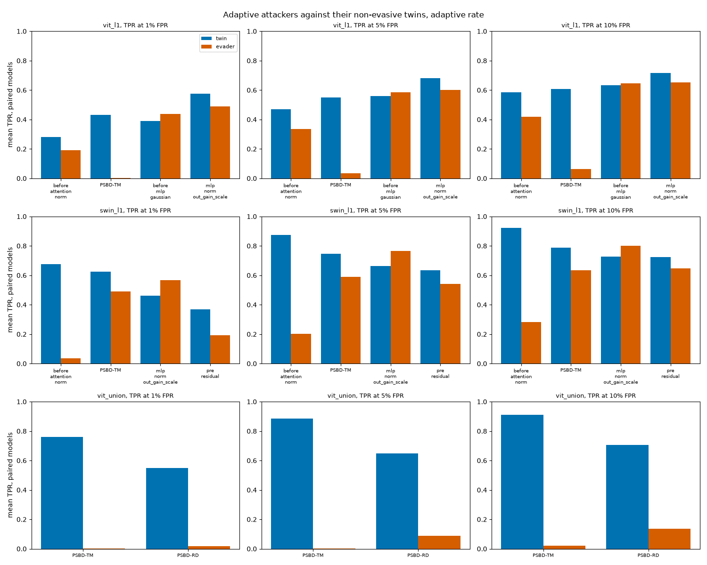

# Evaluation of the final method

The final method is PSBD-TM fused with residual dropout in the middle third of the block stack, blocks 5 to 8 of ViT-B/16 and blocks 9 to 16 of Swin-S, each at its own adaptive rate. It is reported under 2 rules, the plain minimum of the 2 clean-validation percentiles (min) and the plain average of the 2 fractional PSUs (average). TPR at 1%, 5% and 10% FPR is the headline, each beside the FPR realized on the paired clean test split, with AUROC after it. Paired intervals are bootstrap 95% intervals over models (`scripts.paper._common.bootstrap_ci`, 5000 resamples, seed 0). Every number below is rendered by `render_readme.py` from a JSON under `results/_experiments/final_method/`, named with each table.

<!-- results:begin -->
<!-- Everything down to results:end is rendered from the records by render_readme.py on every run. -->

## Calibration by predicted class

Calibrating each score against the clean validation images of the same predicted class helps TaCT a little and costs most of the other attacks. On the 45 models read as the confirmation it lowers PSBD-TM's TPR at 1% FPR on 5 of 6 attacks, and the attack it raises is tact. The idea was that a defender knows each input's predicted class, and that the CIFAR-10 TaCT failure below is a calibration effect. `class_calibration.py` tests 2 forms that need no knowledge of the attack, a class percentile and a class z-score, each shrunk toward the whole validation split with strength $m$ images (the formulas are in its docstring). The shrinkage was chosen on the 9 successful development models from the grid 5, 20, 50, 200 by PSBD-TM's mean TPR over the 3 FPRs, and both forms chose $m$ = 5, the edge of the grid. `preregistration_classcal.json` fixed that rule and 4 predictions at 2026-09-29T22:05:30Z (SHA-256 `d3707251403b848a3c0443bf18b349daa497dbeb4c98c24f1a06c28fa7de56d5`) before the other 45 panel models were read.

The development set said yes and the confirmation said no. The class z-score raised PSBD-TM's TPR at 1% FPR by +0.203 [+0.109, +0.300] on the development set and lowered it by -0.209 [-0.335, -0.088] on the other models, with the realized FPR at the nominal 1% rising to 0.017. The loss is largest on Tiny ImageNet, where TPR at 1% FPR falls from 0.793 to 0.194 over 14 models. All 4 predictions failed.

| prediction | text | verdict |
|---|---|---|
| CC-z-tm | class_z raises PSBD-TM alone's mean TPR at each of 1%, 5% and 10% FPR over the global calibration, with the paired 95% interval excluding 0 | failed |
| CC-z-final | class_z raises the final method's mean TPR at each of 1%, 5% and 10% FPR under both the min and the average rule, with the paired 95% interval excluding 0 | failed |
| CC-no-harm | under class_z no attack's mean TPR at 1% FPR falls by more than 0.02 for PSBD-TM alone, which is the test that the rule is more than a TaCT fix | failed |
| CC-fpr | under class_z the mean realized FPR stays within 0.005 of each nominal FPR for PSBD-TM alone | failed |

The reason is structural. A triggered input is predicted as the target class, so class calibration compares it with the clean validation images the model predicts as the target. Those images are the ones the backdoor has altered. Their PSU median sits below the global median on 41 of 54 panel models (`class_calibration_panel.json`, `models[].target_class_validation`). On Tiny ImageNet, where the loss concentrates, it sits below on 14 of 14 models and the spread is wider than the global one on 13, from only 7 to 14 validation images predicted as the target. The class calibration therefore lowers and widens the bar exactly where triggered inputs land, and does so from a handful of images. Beatrix and TED do best on TaCT here (TPR at 1% FPR 0.729 and 0.831, `detector_comparison.json`) and are class-conditional through their own statistics. Whether their form of conditioning avoids this problem is not tested here.

**All 54 panel models** (`class_calibration_panel.json`, `summary.m=5.all`).

| calibration | method | TPR 1% (minus global) | TPR 5% (minus global) | TPR 10% (minus global) | FPR 1% | FPR 5% | FPR 10% | AUROC |
|---|---|---|---|---|---|---|---|---|
| global | PSBD-TM alone | 0.747 (+0.000 [+0.000, +0.000]) | 0.855 (+0.000 [+0.000, +0.000]) | 0.887 (+0.000 [+0.000, +0.000]) | 0.010 | 0.047 | 0.093 | 0.963 |
| global | final method, min | 0.754 (+0.000 [+0.000, +0.000]) | 0.869 (+0.000 [+0.000, +0.000]) | 0.899 (+0.000 [+0.000, +0.000]) | 0.010 | 0.046 | 0.092 | 0.974 |
| global | final method, average | 0.764 (+0.000 [+0.000, +0.000]) | 0.860 (+0.000 [+0.000, +0.000]) | 0.896 (+0.000 [+0.000, +0.000]) | 0.010 | 0.047 | 0.094 | 0.973 |
| class percentile | PSBD-TM alone | 0.671 (-0.076 [-0.167, +0.003]) | 0.733 (-0.121 [-0.230, -0.028]) | 0.840 (-0.047 [-0.121, +0.017]) | 0.010 | 0.049 | 0.097 | 0.929 |
| class percentile | final method, min | 0.729 (-0.025 [-0.102, +0.045]) | 0.837 (-0.032 [-0.092, +0.020]) | 0.866 (-0.033 [-0.098, +0.024]) | 0.010 | 0.050 | 0.099 | 0.943 |
| class percentile | final method, average | 0.603 (-0.161 [-0.249, -0.076]) | 0.733 (-0.127 [-0.202, -0.060]) | 0.793 (-0.103 [-0.170, -0.046]) | 0.010 | 0.047 | 0.096 | 0.918 |
| class z-score | PSBD-TM alone | 0.607 (-0.140 [-0.261, -0.030]) | 0.831 (-0.024 [-0.097, +0.038]) | 0.902 (+0.015 [-0.021, +0.049]) | 0.016 | 0.050 | 0.096 | 0.932 |
| class z-score | final method, min | 0.754 (-0.001 [-0.088, +0.083]) | 0.849 (-0.020 [-0.072, +0.029]) | 0.898 (-0.001 [-0.045, +0.039]) | 0.021 | 0.057 | 0.104 | 0.947 |
| class z-score | final method, average | 0.767 (+0.003 [-0.070, +0.073]) | 0.862 (+0.002 [-0.041, +0.043]) | 0.896 (-0.001 [-0.046, +0.036]) | 0.018 | 0.054 | 0.102 | 0.943 |

**The 45 models read once as the confirmation** (`class_calibration_rest.json`).

| calibration | method | TPR 1% (minus global) | TPR 5% (minus global) | TPR 10% (minus global) | FPR 1% | FPR 5% | FPR 10% | AUROC |
|---|---|---|---|---|---|---|---|---|
| global | PSBD-TM alone | 0.805 (+0.000 [+0.000, +0.000]) | 0.917 (+0.000 [+0.000, +0.000]) | 0.942 (+0.000 [+0.000, +0.000]) | 0.010 | 0.048 | 0.095 | 0.979 |
| global | final method, min | 0.804 (+0.000 [+0.000, +0.000]) | 0.919 (+0.000 [+0.000, +0.000]) | 0.942 (+0.000 [+0.000, +0.000]) | 0.010 | 0.048 | 0.095 | 0.983 |
| global | final method, average | 0.834 (+0.000 [+0.000, +0.000]) | 0.922 (+0.000 [+0.000, +0.000]) | 0.947 (+0.000 [+0.000, +0.000]) | 0.010 | 0.048 | 0.096 | 0.983 |
| class percentile | PSBD-TM alone | 0.686 (-0.119 [-0.215, -0.031]) | 0.735 (-0.182 [-0.291, -0.078]) | 0.854 (-0.088 [-0.164, -0.016]) | 0.010 | 0.049 | 0.097 | 0.943 |
| class percentile | final method, min | 0.762 (-0.042 [-0.125, +0.040]) | 0.861 (-0.058 [-0.122, +0.000]) | 0.883 (-0.059 [-0.128, +0.002]) | 0.010 | 0.049 | 0.099 | 0.957 |
| class percentile | final method, average | 0.643 (-0.190 [-0.279, -0.103]) | 0.774 (-0.148 [-0.223, -0.081]) | 0.832 (-0.115 [-0.182, -0.056]) | 0.010 | 0.048 | 0.096 | 0.938 |
| class z-score | PSBD-TM alone | 0.596 (-0.209 [-0.335, -0.088]) | 0.850 (-0.066 [-0.144, -0.002]) | 0.929 (-0.013 [-0.047, +0.019]) | 0.017 | 0.051 | 0.098 | 0.950 |
| class z-score | final method, min | 0.773 (-0.031 [-0.126, +0.063]) | 0.870 (-0.049 [-0.100, -0.002]) | 0.920 (-0.021 [-0.067, +0.013]) | 0.022 | 0.058 | 0.106 | 0.961 |
| class z-score | final method, average | 0.792 (-0.041 [-0.116, +0.032]) | 0.889 (-0.033 [-0.075, +0.005]) | 0.920 (-0.027 [-0.075, +0.009]) | 0.019 | 0.056 | 0.104 | 0.957 |

**The development set** (`class_calibration_dev.json`).

| calibration | method | TPR 1% (minus global) | TPR 5% (minus global) | TPR 10% (minus global) | FPR 1% | FPR 5% | FPR 10% | AUROC |
|---|---|---|---|---|---|---|---|---|
| global | PSBD-TM alone | 0.457 (+0.000 [+0.000, +0.000]) | 0.545 (+0.000 [+0.000, +0.000]) | 0.612 (+0.000 [+0.000, +0.000]) | 0.009 | 0.042 | 0.083 | 0.881 |
| global | final method, min | 0.507 (+0.000 [+0.000, +0.000]) | 0.620 (+0.000 [+0.000, +0.000]) | 0.682 (+0.000 [+0.000, +0.000]) | 0.009 | 0.038 | 0.076 | 0.931 |
| global | final method, average | 0.419 (+0.000 [+0.000, +0.000]) | 0.550 (+0.000 [+0.000, +0.000]) | 0.644 (+0.000 [+0.000, +0.000]) | 0.010 | 0.042 | 0.083 | 0.924 |
| class percentile | PSBD-TM alone | 0.600 (+0.143 [+0.069, +0.224]) | 0.726 (+0.180 [+0.081, +0.287]) | 0.771 (+0.159 [+0.067, +0.256]) | 0.009 | 0.046 | 0.097 | 0.862 |
| class percentile | final method, min | 0.565 (+0.058 [-0.097, +0.194]) | 0.718 (+0.098 [-0.006, +0.198]) | 0.781 (+0.099 [-0.013, +0.222]) | 0.008 | 0.050 | 0.098 | 0.875 |
| class percentile | final method, average | 0.405 (-0.014 [-0.246, +0.192]) | 0.529 (-0.021 [-0.254, +0.164]) | 0.599 (-0.045 [-0.239, +0.106]) | 0.010 | 0.046 | 0.096 | 0.820 |
| class z-score | PSBD-TM alone | 0.660 (+0.203 [+0.109, +0.300]) | 0.734 (+0.189 [+0.083, +0.308]) | 0.765 (+0.153 [+0.065, +0.247]) | 0.011 | 0.044 | 0.085 | 0.847 |
| class z-score | final method, min | 0.657 (+0.150 [-0.005, +0.286]) | 0.742 (+0.122 [-0.014, +0.260]) | 0.786 (+0.104 [-0.011, +0.236]) | 0.012 | 0.049 | 0.094 | 0.878 |
| class z-score | final method, average | 0.643 (+0.224 [+0.110, +0.368]) | 0.728 (+0.178 [+0.092, +0.263]) | 0.776 (+0.132 [+0.065, +0.200]) | 0.011 | 0.046 | 0.090 | 0.871 |

**Per attack, all 54 models.** Each cell is mean TPR at 1% / 5% / 10% FPR with the realized FPR at 1% in brackets (`summary.m=5.by_attack`).

| group (models) | method | global, TPR 1 / 5 / 10% (FPR 1%) | class percentile, TPR 1 / 5 / 10% (FPR 1%) | class z-score, TPR 1 / 5 / 10% (FPR 1%) |
|---|---|---|---|---|
| badnet_a2o (12) | PSBD-TM alone | 0.776 / 0.963 / 0.987 (0.010) | 0.744 / 0.806 / 0.879 (0.010) | 0.772 / 0.888 / 0.953 (0.016) |
| badnet_a2o (12) | final method, min | 0.801 / 0.951 / 0.973 (0.010) | 0.802 / 0.875 / 0.881 (0.010) | 0.819 / 0.881 / 0.900 (0.020) |
| badnet_a2o (12) | final method, average | 0.811 / 0.946 / 0.981 (0.010) | 0.573 / 0.707 / 0.760 (0.010) | 0.816 / 0.871 / 0.895 (0.018) |
| tact (3) | PSBD-TM alone | 0.012 / 0.078 / 0.169 (0.003) | 0.128 / 0.400 / 0.481 (0.007) | 0.187 / 0.328 / 0.395 (0.007) |
| tact (3) | final method, min | 0.006 / 0.035 / 0.081 (0.003) | 0.027 / 0.266 / 0.419 (0.002) | 0.171 / 0.269 / 0.342 (0.007) |
| tact (3) | final method, average | 0.010 / 0.070 / 0.161 (0.003) | 0.013 / 0.111 / 0.190 (0.008) | 0.122 / 0.233 / 0.319 (0.005) |
| blend (12) | PSBD-TM alone | 0.829 / 0.915 / 0.943 (0.011) | 0.910 / 0.958 / 0.968 (0.010) | 0.780 / 0.968 / 0.981 (0.017) |
| blend (12) | final method, min | 0.771 / 0.927 / 0.961 (0.010) | 0.913 / 0.980 / 0.988 (0.011) | 0.956 / 0.981 / 0.988 (0.021) |
| blend (12) | final method, average | 0.826 / 0.926 / 0.957 (0.010) | 0.855 / 0.952 / 0.975 (0.010) | 0.964 / 0.984 / 0.991 (0.019) |
| lf (12) | PSBD-TM alone | 0.904 / 0.959 / 0.970 (0.010) | 0.525 / 0.554 / 0.876 (0.010) | 0.528 / 0.870 / 0.959 (0.016) |
| lf (12) | final method, min | 0.908 / 0.967 / 0.975 (0.009) | 0.704 / 0.883 / 0.913 (0.010) | 0.735 / 0.910 / 0.955 (0.022) |
| lf (12) | final method, average | 0.928 / 0.965 / 0.974 (0.010) | 0.645 / 0.822 / 0.889 (0.010) | 0.796 / 0.926 / 0.958 (0.019) |
| bpp (12) | PSBD-TM alone | 0.757 / 0.847 / 0.888 (0.011) | 0.789 / 0.848 / 0.878 (0.010) | 0.582 / 0.868 / 0.896 (0.016) |
| bpp (12) | final method, min | 0.746 / 0.838 / 0.885 (0.010) | 0.781 / 0.848 / 0.874 (0.010) | 0.754 / 0.834 / 0.904 (0.020) |
| bpp (12) | final method, average | 0.729 / 0.843 / 0.888 (0.011) | 0.613 / 0.724 / 0.788 (0.010) | 0.779 / 0.867 / 0.900 (0.018) |
| wanet (3) | PSBD-TM alone | 0.372 / 0.572 / 0.647 (0.012) | 0.084 / 0.137 / 0.235 (0.011) | 0.082 / 0.249 / 0.675 (0.022) |
| wanet (3) | final method, min | 0.671 / 0.873 / 0.918 (0.011) | 0.294 / 0.463 / 0.536 (0.011) | 0.337 / 0.588 / 0.836 (0.030) |
| wanet (3) | final method, average | 0.576 / 0.686 / 0.772 (0.012) | 0.103 / 0.263 / 0.441 (0.010) | 0.277 / 0.699 / 0.825 (0.023) |

**Per dataset, all 54 models** (`summary.m=5.by_dataset`).

| group (models) | method | global, TPR 1 / 5 / 10% (FPR 1%) | class percentile, TPR 1 / 5 / 10% (FPR 1%) | class z-score, TPR 1 / 5 / 10% (FPR 1%) |
|---|---|---|---|---|
| cifar10 (15) | PSBD-TM alone | 0.573 / 0.660 / 0.706 (0.009) | 0.641 / 0.724 / 0.787 (0.010) | 0.635 / 0.715 / 0.782 (0.011) |
| cifar10 (15) | final method, min | 0.508 / 0.705 / 0.757 (0.008) | 0.476 / 0.720 / 0.761 (0.010) | 0.553 / 0.707 / 0.748 (0.011) |
| cifar10 (15) | final method, average | 0.518 / 0.662 / 0.733 (0.009) | 0.248 / 0.424 / 0.529 (0.010) | 0.533 / 0.684 / 0.738 (0.010) |
| cifar100 (12) | PSBD-TM alone | 0.790 / 0.935 / 0.964 (0.009) | 0.668 / 0.735 / 0.889 (0.009) | 0.710 / 0.903 / 0.927 (0.016) |
| cifar100 (12) | final method, min | 0.783 / 0.931 / 0.966 (0.010) | 0.786 / 0.883 / 0.912 (0.011) | 0.850 / 0.904 / 0.943 (0.023) |
| cifar100 (12) | final method, average | 0.860 / 0.950 / 0.973 (0.010) | 0.784 / 0.867 / 0.902 (0.010) | 0.870 / 0.919 / 0.942 (0.022) |
| gtsrb (13) | PSBD-TM alone | 0.860 / 0.897 / 0.930 (0.010) | 0.807 / 0.872 / 0.973 (0.010) | 0.923 / 0.959 / 0.970 (0.012) |
| gtsrb (13) | final method, min | 0.866 / 0.891 / 0.913 (0.009) | 0.880 / 0.929 / 0.959 (0.009) | 0.929 / 0.950 / 0.963 (0.012) |
| gtsrb (13) | final method, average | 0.830 / 0.887 / 0.925 (0.010) | 0.813 / 0.885 / 0.916 (0.011) | 0.919 / 0.945 / 0.961 (0.012) |
| tiny (14) | PSBD-TM alone | 0.793 / 0.955 / 0.975 (0.012) | 0.580 / 0.613 / 0.733 (0.011) | 0.194 / 0.775 / 0.945 (0.025) |
| tiny (14) | final method, min | 0.890 / 0.972 / 0.979 (0.011) | 0.810 / 0.840 / 0.851 (0.011) | 0.723 / 0.860 / 0.960 (0.035) |
| tiny (14) | final method, average | 0.885 / 0.970 / 0.979 (0.011) | 0.634 / 0.809 / 0.868 (0.009) | 0.790 / 0.928 / 0.964 (0.029) |

**TaCT against the global PSBD-TM threshold.** The share of each group below the threshold, and the group medians of fractional PSU (`tact_placement`).

| model | nominal FPR | global threshold | source clean below | target clean below | triggered below |
|---|---|---|---|---|---|
| `vit_cifar10_tact_0_01` | 0.01 | 0.515 | 0.004 | 0.001 | 0.005 |
| `vit_cifar10_tact_0_01` | 0.05 | 0.641 | 0.006 | 0.004 | 0.005 |
| `vit_cifar10_tact_0_01` | 0.10 | 0.702 | 0.014 | 0.016 | 0.005 |
| `vit_cifar10_tact_0_05` | 0.01 | 0.024 | 0.005 | 0.005 | 0.000 |
| `vit_cifar10_tact_0_05` | 0.05 | 0.184 | 0.005 | 0.014 | 0.000 |
| `vit_cifar10_tact_0_05` | 0.10 | 0.374 | 0.005 | 0.024 | 0.000 |
| `vit_gtsrb_tact_0_05` | 0.01 | 0.150 | 0.000 | 0.000 | 0.030 |
| `vit_gtsrb_tact_0_05` | 0.05 | 0.454 | 0.000 | 0.000 | 0.230 |
| `vit_gtsrb_tact_0_05` | 0.10 | 0.633 | 0.000 | 0.000 | 0.502 |

| model | validation | source clean | target clean | triggered |
|---|---|---|---|---|
| `vit_cifar10_tact_0_01` | 0.896 | 0.995 | 0.882 | 0.904 |
| `vit_cifar10_tact_0_05` | 0.942 | 0.999 | 0.989 | 0.972 |
| `vit_gtsrb_tact_0_05` | 0.967 | 0.974 | 0.993 | 0.627 |



## The TaCT calibration effect

On the CIFAR-10 TaCT models the high AUROC and the TPR near 0 measure different populations. AUROC compares triggered inputs with their paired clean images, and every one of those comes from the source class, while the threshold comes from all-class validation. Clean source-class images are more fragile under token masking than the validation average, so they rarely fall below the all-class threshold, and triggered inputs sit between them and the rest. A threshold read from source-class validation alone (204 images on `vit_cifar10_tact_0_01`) recovers most of the TPR at its own FPR. A defender does not know the source class, so this is a finding about what the metric compares and not a deployable fix. The deployable version is a threshold per predicted class. It lifts TPR at 5% FPR by more than 0.2 on 2 of the 3 TaCT models (`anomalies.json`, `tact`). The panel-wide test above shows what it costs elsewhere.

| model | nominal FPR | global threshold TPR (source FPR) | other-class FPR | source-only threshold TPR (FPR) | per-predicted-class TPR (FPR) |
|---|---|---|---|---|---|
| `vit_cifar10_tact_0_01` | 0.01 | 0.005 (0.004) | 0.013 | 0.005 (0.010) | 0.003 (0.006) |
| `vit_cifar10_tact_0_01` | 0.05 | 0.005 (0.006) | 0.054 | 1.000 (0.064) | 0.008 (0.045) |
| `vit_cifar10_tact_0_01` | 0.10 | 0.005 (0.014) | 0.105 | 1.000 (0.106) | 0.010 (0.092) |
| `vit_cifar10_tact_0_05` | 0.01 | 0.000 (0.005) | 0.015 | 0.256 (0.018) | 0.304 (0.028) |
| `vit_cifar10_tact_0_05` | 0.05 | 0.000 (0.005) | 0.061 | 0.864 (0.052) | 0.487 (0.078) |
| `vit_cifar10_tact_0_05` | 0.10 | 0.000 (0.005) | 0.120 | 0.985 (0.127) | 0.550 (0.139) |
| `vit_gtsrb_tact_0_05` | 0.01 | 0.030 (0.000) | 0.013 | 0.884 (0.026) | 0.975 (0.026) |
| `vit_gtsrb_tact_0_05` | 0.05 | 0.230 (0.000) | 0.057 | 0.907 (0.053) | 0.977 (0.053) |
| `vit_gtsrb_tact_0_05` | 0.10 | 0.502 (0.000) | 0.115 | 0.914 (0.099) | 0.979 (0.101) |

## The min rule at 1% FPR

The collapse of the min rule at 1% FPR on single models comes from the budget split, and ties play no part in it. On the panel 3 models lose at least 0.2 of TPR at 1% FPR under the min rule against PSBD-TM alone while keeping AUROC at or above 0.95 (`vit_cifar100_blend_0_01`, `vit_cifar10_badnet_a2o_0_1`, `vit_cifar10_blend_0_05`). At each of them at most 2 of the 2000 validation images sit on the threshold, the realized FPR stays at or below the nominal 1% and breaking ties by the average changes nothing. What changes is the budget. The 1% quantile of the minimum of 2 percentiles admits only about 0.5% of each probe's validation scores, and PSBD-TM alone at that effective quantile loses as much TPR as the min rule does, because clean validation PSU falls steeply between its 0.5% and 1% quantiles while the middle band alone reaches at most 0.128 TPR at 1% FPR on these models. A tie-break is therefore no fix. The weighted minimum at 0.9 and 0.1 of `experiments/cache_readouts/`, which gives PSBD-TM most of the budget, stays within 0.048 of PSBD-TM alone on all 3 models. The average rule recovers the loss on 1 of them (`anomalies.json`, `min_rule`, and `fusion_rules_panel.json` of the cache readouts).

| model | PSBD-TM TPR 1% | min TPR 1% | min FPR 1% | tie share | effective PSBD-TM quantile | PSBD-TM TPR there | clean PSU at 0.5% / 1% | triggered PSU 10th pct | band alone TPR 1% | min, tie broken |
|---|---|---|---|---|---|---|---|---|---|---|
| `vit_cifar100_blend_0_01` | 0.562 | 0.206 | 0.007 | 0.001 | 0.005 | 0.231 | 0.099 / 0.322 | 0.054 | 0.002 | 0.232 |
| `vit_cifar10_badnet_a2o_0_1` | 0.482 | 0.003 | 0.007 | 0.001 | 0.005 | 0.000 | -0.115 / 0.047 | 0.009 | 0.008 | 0.004 |
| `vit_cifar10_blend_0_05` | 0.640 | 0.060 | 0.010 | 0.001 | 0.007 | 0.000 | -0.138 / 0.096 | 0.003 | 0.128 | 0.061 |

## The final method against the competitor detectors

On the 54 ViT panel models the final method leads every competitor at 1%, 5% and 10% FPR under both rules. Every paired interval against the best competitor at that FPR excludes 0. The best competitor at 1% FPR is `ted` and at 5% `ibd_psc_calibrated`. Detector records missing: none. The Swin detectors have no records on disk, so no Swin table exists (`detector_comparison.json`).

| method | models | TPR 1% (FPR) | TPR 5% (FPR) | TPR 10% (FPR) | AUROC |
|---|---|---|---|---|---|
| `final_average` | 54 | 0.764 (0.010) | 0.860 (0.047) | 0.896 (0.094) | 0.973 |
| `final_min` | 54 | 0.754 (0.010) | 0.869 (0.046) | 0.899 (0.092) | 0.974 |
| `psbd_tm` | 54 | 0.747 (0.010) | 0.855 (0.047) | 0.887 (0.093) | 0.963 |
| `ted` | 54 | 0.518 (0.011) | 0.633 (0.050) | 0.702 (0.103) | 0.885 |
| `beatrix` | 54 | 0.445 (0.006) | 0.604 (0.031) | 0.666 (0.064) | 0.896 |
| `strip` | 54 | 0.436 (0.009) | 0.620 (0.047) | 0.706 (0.096) | 0.857 |
| `ibd_psc_calibrated` | 54 | 0.384 (0.007) | 0.725 (0.046) | 0.825 (0.093) | 0.936 |
| `cd_l` | 54 | 0.341 (0.009) | 0.451 (0.044) | 0.536 (0.094) | 0.808 |
| `teco` | 54 | 0.265 (0.009) | 0.410 (0.047) | 0.492 (0.094) | 0.743 |
| `scale_up_data_limited` | 54 | 0.226 (0.010) | 0.298 (0.053) | 0.350 (0.099) | 0.636 |
| `confidence` | 54 | 0.099 (0.010) | 0.245 (0.047) | 0.339 (0.097) | 0.688 |
| `ibd_psc` | 54 | 0.082 (0.004) | 0.290 (0.038) | 0.400 (0.092) | 0.732 |
| `sentinet` | 54 | 0.059 (0.014) | 0.072 (0.062) | 0.101 (0.111) | 0.418 |
| `scale_up` | 54 | 0.021 (0.000) | 0.193 (0.018) | 0.340 (0.045) | 0.728 |

**Paired differences against the best competitor at each FPR.**

| method | TPR 1% minus best | TPR 5% minus best | TPR 10% minus best | AUROC minus best |
|---|---|---|---|---|
| PSBD-TM alone | +0.229 [+0.095, +0.364] against `ted` | +0.130 [+0.056, +0.209] against `ibd_psc_calibrated` | +0.062 [+0.007, +0.123] against `ibd_psc_calibrated` | +0.027 [+0.006, +0.049] against `ibd_psc_calibrated` |
| final method, min | +0.236 [+0.098, +0.376] against `ted` | +0.144 [+0.065, +0.227] against `ibd_psc_calibrated` | +0.074 [+0.010, +0.141] against `ibd_psc_calibrated` | +0.038 [+0.018, +0.059] against `ibd_psc_calibrated` |
| final method, average | +0.246 [+0.105, +0.386] against `ted` | +0.135 [+0.058, +0.216] against `ibd_psc_calibrated` | +0.071 [+0.015, +0.132] against `ibd_psc_calibrated` | +0.037 [+0.017, +0.058] against `ibd_psc_calibrated` |

**Per attack.** Each cell is mean TPR at 1% / 5% / 10% FPR, for our 3 methods and the 4 competitors with the highest TPR at 1% FPR.

| attack (models) | PSBD-TM alone | final method, min | final method, average | `ted` | `beatrix` | `strip` | `ibd_psc_calibrated` |
|---|---|---|---|---|---|---|---|
| badnet_a2o (12) | 0.776 / 0.963 / 0.987 | 0.801 / 0.951 / 0.973 | 0.811 / 0.946 / 0.981 | 0.570 / 0.685 / 0.760 | 0.462 / 0.654 / 0.665 | 0.499 / 0.819 / 0.911 | 0.369 / 0.766 / 0.928 |
| tact (3) | 0.012 / 0.078 / 0.169 | 0.006 / 0.035 / 0.081 | 0.010 / 0.070 / 0.161 | 0.831 / 0.903 / 0.934 | 0.729 / 0.928 / 0.994 | 0.065 / 0.146 / 0.219 | 0.064 / 0.223 / 0.376 |
| blend (12) | 0.829 / 0.915 / 0.943 | 0.771 / 0.927 / 0.961 | 0.826 / 0.926 / 0.957 | 0.490 / 0.635 / 0.703 | 0.500 / 0.684 / 0.737 | 0.624 / 0.768 / 0.824 | 0.666 / 0.982 / 0.997 |
| lf (12) | 0.904 / 0.959 / 0.970 | 0.908 / 0.967 / 0.975 | 0.928 / 0.965 / 0.974 | 0.501 / 0.601 / 0.662 | 0.367 / 0.499 / 0.641 | 0.306 / 0.465 / 0.609 | 0.220 / 0.652 / 0.784 |
| bpp (12) | 0.757 / 0.847 / 0.888 | 0.746 / 0.838 / 0.885 | 0.729 / 0.843 / 0.888 | 0.529 / 0.642 / 0.717 | 0.484 / 0.621 / 0.662 | 0.515 / 0.685 / 0.752 | 0.383 / 0.697 / 0.779 |
| wanet (3) | 0.372 / 0.572 / 0.647 | 0.671 / 0.873 / 0.918 | 0.576 / 0.686 / 0.772 | 0.141 / 0.246 / 0.333 | 0.028 / 0.121 / 0.179 | 0.007 / 0.054 / 0.110 | 0.306 / 0.431 / 0.519 |

**Per attack, TPR at 1% FPR, every method.**

| method | badnet_a2o | tact | blend | lf | bpp | wanet |
|---|---|---|---|---|---|---|
| `final_average` | 0.811 | 0.010 | 0.826 | 0.928 | 0.729 | 0.576 |
| `final_min` | 0.801 | 0.006 | 0.771 | 0.908 | 0.746 | 0.671 |
| `psbd_tm` | 0.776 | 0.012 | 0.829 | 0.904 | 0.757 | 0.372 |
| `ted` | 0.570 | 0.831 | 0.490 | 0.501 | 0.529 | 0.141 |
| `beatrix` | 0.462 | 0.729 | 0.500 | 0.367 | 0.484 | 0.028 |
| `strip` | 0.499 | 0.065 | 0.624 | 0.306 | 0.515 | 0.007 |
| `ibd_psc_calibrated` | 0.369 | 0.064 | 0.666 | 0.220 | 0.383 | 0.306 |
| `cd_l` | 0.697 | 0.010 | 0.296 | 0.011 | 0.517 | 0.034 |
| `teco` | 0.673 | 0.304 | 0.252 | 0.028 | 0.048 | 0.455 |
| `scale_up_data_limited` | 0.583 | 0.333 | 0.158 | 0.193 | 0.000 | 0.004 |
| `confidence` | 0.157 | 0.002 | 0.103 | 0.145 | 0.028 | 0.053 |
| `ibd_psc` | 0.048 | 0.000 | 0.117 | 0.126 | 0.004 | 0.301 |
| `sentinet` | 0.226 | 0.000 | 0.013 | 0.001 | 0.027 | 0.001 |
| `scale_up` | 0.083 | 0.000 | 0.000 | 0.013 | 0.000 | 0.000 |



## Swin second probe, attempt 1

The middle band does not carry over to Swin-S as a second probe, and both pre-registered predictions failed. `experiments/cache_readouts/preregistration_swin.json` fixed the band (blocks 9 to 16), both rules and the prediction that TPR at 1%, 5% and 10% FPR rises above PSBD-TM alone at 2026-09-29T21:57:00Z, before any triggered score of the band was read, and `fusion_readout.py --set swin_panel` read it once (SHA-256 `383a280f7fd2294b71237ba38e7311ddac21f50b11f6280712e272329f29b565`). The band was already cached on every Swin panel model that PSBD-TM can score, so no sweep was needed. 63 of 65 successful Swin-S models are scored. `swin_cifar10_tact_0_01`, `swin_cifar10_tact_0_05` never reach the adaptive target under PSBD-TM itself, so neither PSBD-TM nor the final method has a rate for them (`fusion_swin_panel.json`).

| prediction | verdict | TPR 1% minus PSBD-TM | TPR 5% minus PSBD-TM | TPR 10% minus PSBD-TM |
|---|---|---|---|---|
| SWIN-min-tpr | failed | +0.013 [-0.015, +0.050] | -0.002 [-0.026, +0.025] | -0.003 [-0.013, +0.007] |
| SWIN-average-tpr | failed | -0.042 [-0.095, +0.011] | -0.040 [-0.084, +0.000] | -0.027 [-0.056, -0.003] |

| method | TPR 1% (minus PSBD-TM) | TPR 5% (minus PSBD-TM) | TPR 10% (minus PSBD-TM) | FPR 1% | FPR 5% | FPR 10% | AUROC |
|---|---|---|---|---|---|---|---|
| PSBD-TM alone | 0.824 (+0.000 [+0.000, +0.000]) | 0.905 (+0.000 [+0.000, +0.000]) | 0.939 (+0.000 [+0.000, +0.000]) | 0.009 | 0.044 | 0.092 | 0.973 |
| final method, min | 0.838 (+0.013 [-0.015, +0.050]) | 0.903 (-0.002 [-0.026, +0.025]) | 0.936 (-0.003 [-0.013, +0.007]) | 0.009 | 0.044 | 0.092 | 0.971 |
| final method, average | 0.782 (-0.042 [-0.095, +0.011]) | 0.865 (-0.040 [-0.084, +0.000]) | 0.911 (-0.027 [-0.056, -0.003]) | 0.009 | 0.046 | 0.093 | 0.965 |

**Per attack, TPR at 1% / 5% / 10% FPR.**

| attack (models) | PSBD-TM alone | final method, min | final method, average |
|---|---|---|---|
| badnet_a2o (12) | 0.989 / 0.996 / 1.000 | 0.976 / 0.994 / 0.997 | 0.834 / 0.983 / 0.997 |
| blend (12) | 0.965 / 0.981 / 0.986 | 0.961 / 0.985 / 0.990 | 0.921 / 0.960 / 0.983 |
| lf (12) | 0.796 / 0.907 / 0.942 | 0.818 / 0.896 / 0.935 | 0.704 / 0.794 / 0.849 |
| bpp (12) | 0.893 / 0.918 / 0.938 | 0.883 / 0.910 / 0.925 | 0.860 / 0.890 / 0.904 |
| wanet (8) | 0.333 / 0.704 / 0.872 | 0.426 / 0.717 / 0.879 | 0.463 / 0.655 / 0.857 |
| adaptive_blend (7) | 0.795 / 0.821 / 0.824 | 0.816 / 0.821 / 0.823 | 0.817 / 0.820 / 0.822 |

## Swin second probe, attempt 2

The late band carries over under the min rule, which was the 2nd and last pre-registered attempt. `preregistration_swin_late.json` (SHA-256 `8889cbf9e9dd9573b1d58d182df5e1f2c9f27467f3c8e147d25f312db014aa91`, written at 2026-09-29T22:47:00Z before any detection number of the band was read) chose residual dropout in Swin-S blocks 17 to 24 from the depth of WaNet's backdoor direction in `experiments/backdoor_manifestation/`, onset median 16 and range 15 to 23 of 24 blocks, a measurement that never reads detection. `swin_late_readout.py` read it once (`fusion_swin_panel_late.json`).

The min rule held every prediction. On the models where both placements reach the adaptive target it raises TPR at 1%, 5% and 10% FPR with every interval above 0, and on the 8 WaNet models TPR at 1% FPR rises from 0.333 to 0.889. The average rule is inconclusive on that reading because 2 of its intervals touch 0. It holds once the nearest-rate models are added. The gain is concentrated. BadNets loses -0.021 [-0.035, -0.008] at 1% FPR under the min rule. Blend, LF and BPP move by at most 0.005 there. WaNet carries most of the gain. As a 2nd attempt chosen after the 1st failed, it carries a selection cost the interval does not include.

Coverage is partial. PSBD-TM reaches the adaptive target on 63 of 65 successful Swin-S models and the late band on 39. The largest clean-validation shift of the other 24 lies between 0.563 and 0.786, so the primary reading covers 39 models and the labeled second reading adds the 24 at their nearest rate (`coverage`).

| prediction | reading | models | TPR 1% minus PSBD-TM | TPR 5% minus PSBD-TM | TPR 10% minus PSBD-TM | verdict |
|---|---|---|---|---|---|---|
| SWIN2-min-tpr | adaptive rate only | 39 | +0.114 [+0.036, +0.204] | +0.048 [+0.009, +0.094] | +0.018 [+0.004, +0.037] | held |
| SWIN2-average-tpr | adaptive rate only | 39 | +0.031 [-0.002, +0.073] | +0.025 [+0.001, +0.056] | +0.013 [-0.000, +0.031] | inconclusive |
| SWIN2-min-wanet | adaptive rate only | 8 | +0.556 [+0.344, +0.754] | +0.242 [+0.102, +0.392] | +0.079 [+0.022, +0.148] | held |
| SWIN2-average-wanet | adaptive rate only | 8 | +0.170 [+0.050, +0.314] | +0.133 [+0.043, +0.248] | +0.065 [+0.013, +0.136] | held |
| SWIN2-min-tpr | with the nearest-rate models | 63 | +0.084 [+0.031, +0.142] | +0.037 [+0.011, +0.068] | +0.015 [+0.004, +0.028] | held |
| SWIN2-average-tpr | with the nearest-rate models | 63 | +0.024 [+0.002, +0.052] | +0.021 [+0.004, +0.042] | +0.011 [+0.000, +0.023] | held |
| SWIN2-min-wanet | with the nearest-rate models | 8 | +0.556 [+0.344, +0.754] | +0.242 [+0.102, +0.392] | +0.079 [+0.022, +0.148] | held |
| SWIN2-average-wanet | with the nearest-rate models | 8 | +0.170 [+0.050, +0.314] | +0.133 [+0.043, +0.248] | +0.065 [+0.013, +0.136] | held |

**Adaptive rate only.**

| method | TPR 1% (minus PSBD-TM) | TPR 5% (minus PSBD-TM) | TPR 10% (minus PSBD-TM) | FPR 1% | FPR 5% | FPR 10% | AUROC |
|---|---|---|---|---|---|---|---|
| PSBD-TM alone | 0.808 (+0.000 [+0.000, +0.000]) | 0.913 (+0.000 [+0.000, +0.000]) | 0.955 (+0.000 [+0.000, +0.000]) | 0.009 | 0.045 | 0.094 | 0.978 |
| final method, min | 0.922 (+0.114 [+0.036, +0.204]) | 0.961 (+0.048 [+0.009, +0.094]) | 0.973 (+0.018 [+0.004, +0.037]) | 0.008 | 0.046 | 0.093 | 0.986 |
| final method, average | 0.839 (+0.031 [-0.002, +0.073]) | 0.938 (+0.025 [+0.001, +0.056]) | 0.968 (+0.013 [-0.000, +0.031]) | 0.008 | 0.045 | 0.094 | 0.981 |

**With the nearest-rate models, labeled.**

| method | TPR 1% (minus PSBD-TM) | TPR 5% (minus PSBD-TM) | TPR 10% (minus PSBD-TM) | FPR 1% | FPR 5% | FPR 10% | AUROC |
|---|---|---|---|---|---|---|---|
| PSBD-TM alone | 0.824 (+0.000 [+0.000, +0.000]) | 0.905 (+0.000 [+0.000, +0.000]) | 0.939 (+0.000 [+0.000, +0.000]) | 0.009 | 0.044 | 0.092 | 0.973 |
| final method, min | 0.908 (+0.084 [+0.031, +0.142]) | 0.942 (+0.037 [+0.011, +0.068]) | 0.954 (+0.015 [+0.004, +0.028]) | 0.009 | 0.045 | 0.093 | 0.977 |
| final method, average | 0.849 (+0.024 [+0.002, +0.052]) | 0.926 (+0.021 [+0.004, +0.042]) | 0.949 (+0.011 [+0.000, +0.023]) | 0.009 | 0.045 | 0.093 | 0.973 |

**Per attack and per poison rate, adaptive rate only.** TPR at 1% / 5% / 10% FPR and the realized FPR at 1%.

| group (models) | PSBD-TM alone, TPR 1 / 5 / 10% | final method, min, TPR 1 / 5 / 10% | final method, average, TPR 1 / 5 / 10% | PSBD-TM alone, FPR 1% | final method, min, FPR 1% | final method, average, FPR 1% |
|---|---|---|---|---|---|---|
| badnet_a2o (7) | 0.982 / 0.994 / 0.999 | 0.962 / 0.991 / 0.999 | 0.954 / 0.979 / 0.998 | 0.009 | 0.009 | 0.009 |
| blend (6) | 0.996 / 0.999 / 1.000 | 0.991 / 0.999 / 1.000 | 0.996 / 1.000 / 1.000 | 0.011 | 0.010 | 0.010 |
| lf (7) | 0.791 / 0.905 / 0.936 | 0.794 / 0.887 / 0.936 | 0.789 / 0.904 / 0.935 | 0.009 | 0.009 | 0.009 |
| bpp (6) | 0.982 / 0.994 / 0.996 | 0.978 / 0.994 / 0.997 | 0.983 / 0.995 / 0.997 | 0.009 | 0.010 | 0.008 |
| wanet (8) | 0.333 / 0.704 / 0.872 | 0.889 / 0.946 / 0.951 | 0.503 / 0.837 / 0.937 | 0.006 | 0.006 | 0.006 |
| adaptive_blend (5) | 0.912 / 0.948 / 0.949 | 0.946 / 0.962 / 0.968 | 0.926 / 0.948 / 0.950 | 0.007 | 0.006 | 0.007 |
| rate 0.01 (9) | 0.888 / 0.952 / 0.974 | 0.875 / 0.939 / 0.977 | 0.867 / 0.944 / 0.976 | 0.010 | 0.010 | 0.010 |
| rate 0.05 (15) | 0.757 / 0.903 / 0.942 | 0.905 / 0.948 / 0.956 | 0.787 / 0.930 / 0.948 | 0.008 | 0.007 | 0.008 |
| rate 0.1 (15) | 0.810 / 0.901 / 0.957 | 0.966 / 0.987 / 0.988 | 0.875 / 0.942 / 0.983 | 0.009 | 0.008 | 0.008 |

**Per attack and per poison rate, with the nearest-rate models.**

| group (models) | PSBD-TM alone, TPR 1 / 5 / 10% | final method, min, TPR 1 / 5 / 10% | final method, average, TPR 1 / 5 / 10% | PSBD-TM alone, FPR 1% | final method, min, FPR 1% | final method, average, FPR 1% |
|---|---|---|---|---|---|---|
| badnet_a2o (12) | 0.989 / 0.996 / 1.000 | 0.976 / 0.995 / 0.999 | 0.971 / 0.987 / 0.999 | 0.008 | 0.009 | 0.008 |
| blend (12) | 0.965 / 0.981 / 0.986 | 0.973 / 0.993 / 0.998 | 0.968 / 0.988 / 0.995 | 0.010 | 0.010 | 0.011 |
| lf (12) | 0.796 / 0.907 / 0.942 | 0.851 / 0.921 / 0.955 | 0.821 / 0.929 / 0.953 | 0.009 | 0.009 | 0.009 |
| bpp (12) | 0.893 / 0.918 / 0.938 | 0.898 / 0.920 / 0.931 | 0.890 / 0.918 / 0.931 | 0.009 | 0.009 | 0.009 |
| wanet (8) | 0.333 / 0.704 / 0.872 | 0.889 / 0.946 / 0.951 | 0.503 / 0.837 / 0.937 | 0.006 | 0.006 | 0.006 |
| adaptive_blend (7) | 0.795 / 0.821 / 0.824 | 0.819 / 0.833 / 0.841 | 0.805 / 0.822 / 0.826 | 0.007 | 0.007 | 0.008 |
| rate 0.01 (16) | 0.811 / 0.891 / 0.927 | 0.847 / 0.904 / 0.936 | 0.818 / 0.904 / 0.934 | 0.009 | 0.010 | 0.010 |
| rate 0.05 (23) | 0.788 / 0.889 / 0.917 | 0.887 / 0.921 / 0.929 | 0.806 / 0.907 / 0.922 | 0.008 | 0.008 | 0.008 |
| rate 0.1 (24) | 0.869 / 0.930 / 0.967 | 0.970 / 0.987 / 0.990 | 0.910 / 0.958 / 0.987 | 0.008 | 0.008 | 0.008 |

## Adaptive attackers on disk

Evasion against 1 probe does not transfer, and evasion against 3 probes costs a mean -6.4 clean-accuracy points against the non-evasive twin (-5.1 against the benign reference) and leaves 0 of 14 successful at the 2-point bar (7 at 5 points, 12 clearing the ASR bar). The ViT single-probe attackers were trained against PSBD-TM itself, and among those that keep attack success the unprobed operators still read mean AUROC 0.832 to 0.953. The Swin single-probe attackers were trained against dropout at the attention input, and PSBD-TM, unprobed there, reads 0.951 against 0.982 on their twins. The single-probe evasion is not free either. It costs -4.0 points on ViT and -5.6 on Swin against the twins, and leaves 10 of 60 ViT and 0 of 60 Swin models successful at 2 points.

The 3-probe attacker does transfer to PSBD-RD. It trained against PSBD-TM, dropout at the attention input and gain scaling after the MLP norm, never against dropout after the residual adds, and still PSBD-RD reads one-sided AUROC 0.358 against 0.890 on the twins, inverted on 8 of 12 of the attackers that clear the ASR bar, with TPR at 1% FPR 0.003. PSBD-TM reads 0.175. The two-sided diagnostic hides this, `vit_cifar100_blend_0_05_evade_union` reads 0.016 one-sided and 0.984 two-sided under PSBD-TM, and the decision rule is one-sided. Whether the middle band transfers the same way is item 3 of the GPU plan, since no evasive checkpoint caches it.

Attack success is read from each model's PSBD baseline cache and clean accuracy from its `args.json`. The verdicts come from `scripts.coverage_ledger.classify_cell` with the Swin benign references for Swin (`adaptive_attackers.json`). The canonical families are the 120 `_evade_l1` models of CIFAR-100 and Tiny ImageNet and the 14 `vit_cifar100_*_evade_union` models. The CIFAR-10 lambda sweep, the smoke runs and the paper-attack variants are other experiments and stay out.

| attacker | models | clear ASR | successful 2-point | successful 5-point | twins successful 2-point | mean ASR | twin mean ASR | clean accuracy vs twin (points) | clean accuracy vs benign (points) |
|---|---|---|---|---|---|---|---|---|---|
| ViT, 1 probe | 60 | 30 | 10 | 17 | 27 | 0.682 | 0.762 | -4.0 | -3.6 |
| Swin-S, 1 probe | 60 | 31 | 0 | 8 | 32 | 0.668 | 0.856 | -5.6 | -6.2 |
| ViT, 3 probes | 14 | 12 | 0 | 7 | 12 | 0.921 | 0.925 | -6.4 | -5.1 |

**Detection of the attackers that clear the ASR bar, adaptive rate, one-sided.** "Inverted" counts one-sided AUROC below 0.5.

| attacker | placement | probe | models | evader TPR 1 / 5 / 10% | evader FPR 1 / 5 / 10% | twin TPR 1 / 5 / 10% | evader AUROC | two-sided | twin AUROC | inverted |
|---|---|---|---|---|---|---|---|---|---|---|
| ViT, 1 probe | `before_attention_norm` | unprobed | 30 | 0.346 / 0.533 / 0.628 | 0.011 / 0.053 / 0.104 | 0.419 / 0.674 / 0.812 | 0.832 | 0.848 | 0.925 | 2 of 30 |
| ViT, 1 probe | `before_attention_norm_token_mask` | probed | 30 | 0.001 / 0.051 / 0.080 | 0.011 / 0.052 / 0.103 | 0.753 / 0.890 / 0.914 | 0.332 | 0.834 | 0.927 | 20 of 30 |
| ViT, 1 probe | `before_mlp_gaussian` | unprobed | 30 | 0.684 / 0.844 / 0.891 | 0.011 / 0.052 / 0.103 | 0.602 / 0.778 / 0.828 | 0.948 | 0.948 | 0.904 | 0 of 30 |
| ViT, 1 probe | `mlp_norm_out_gain_scale` | unprobed | 30 | 0.781 / 0.877 / 0.901 | 0.011 / 0.051 / 0.102 | 0.760 / 0.861 / 0.896 | 0.953 | 0.953 | 0.962 | 0 of 30 |
| Swin-S, 1 probe | `before_attention_norm` | probed | 31 | 0.040 / 0.215 / 0.297 | 0.011 / 0.051 / 0.101 | 0.757 / 0.934 / 0.969 | 0.508 | 0.825 | 0.982 | 17 of 31 |
| Swin-S, 1 probe | `before_attention_norm_token_mask` | unprobed | 31 | 0.785 / 0.898 / 0.923 | 0.010 / 0.049 / 0.099 | 0.919 / 0.965 / 0.977 | 0.951 | 0.959 | 0.982 | 1 of 31 |
| Swin-S, 1 probe | `mlp_norm_out_gain_scale` | unprobed | 31 | 0.673 / 0.861 / 0.885 | 0.009 / 0.047 / 0.098 | 0.517 / 0.728 / 0.783 | 0.930 | 0.944 | 0.921 | 2 of 31 |
| Swin-S, 1 probe | `pre_residual` | unprobed | 31 | 0.216 / 0.617 / 0.734 | 0.010 / 0.050 / 0.099 | 0.417 / 0.691 / 0.774 | 0.868 | 0.899 | 0.897 | 2 of 31 |
| ViT, 3 probes | `before_attention_norm_token_mask` | probed | 12 | 0.000 / 0.002 / 0.008 | 0.012 / 0.056 / 0.104 | 0.790 / 0.935 / 0.964 | 0.175 | 0.852 | 0.979 | 10 of 12 |
| ViT, 3 probes | `post_residual` | unprobed | 12 | 0.003 / 0.035 / 0.072 | 0.011 / 0.054 / 0.103 | 0.543 / 0.658 / 0.723 | 0.358 | 0.760 | 0.890 | 8 of 12 |

**Every attacker, cleared or not.**

| attacker | placement | models | evader AUROC | two-sided | inverted |
|---|---|---|---|---|---|
| ViT, 1 probe | `before_attention_norm` | 60 | 0.677 | 0.709 | 15 of 60 |
| ViT, 1 probe | `before_attention_norm_token_mask` | 60 | 0.343 | 0.743 | 49 of 60 |
| ViT, 1 probe | `before_mlp_gaussian` | 59 | 0.761 | 0.774 | 12 of 59 |
| ViT, 1 probe | `mlp_norm_out_gain_scale` | 60 | 0.780 | 0.789 | 5 of 60 |
| Swin-S, 1 probe | `before_attention_norm` | 60 | 0.495 | 0.716 | 31 of 60 |
| Swin-S, 1 probe | `before_attention_norm_token_mask` | 60 | 0.769 | 0.785 | 6 of 60 |
| Swin-S, 1 probe | `mlp_norm_out_gain_scale` | 60 | 0.757 | 0.776 | 9 of 60 |
| Swin-S, 1 probe | `pre_residual` | 60 | 0.724 | 0.749 | 7 of 60 |
| ViT, 3 probes | `before_attention_norm_token_mask` | 14 | 0.234 | 0.814 | 10 of 14 |
| ViT, 3 probes | `post_residual` | 14 | 0.406 | 0.751 | 8 of 14 |

**Placements cached on the attackers.** The final method's middle band is cached on none of them, so it cannot be scored yet.

| attacker | placements cached (models) |
|---|---|
| ViT, 1 probe | `before_attention_norm` (60), `before_attention_norm_token_mask` (60), `before_mlp_gaussian` (59), `mlp_norm_out_gain_scale` (60) |
| Swin-S, 1 probe | `before_attention_norm` (60), `before_attention_norm_token_mask` (60), `mlp_norm_out_gain_scale` (60), `pre_residual` (60) |
| ViT, 3 probes | `before_attention_norm_token_mask` (14), `post_residual` (14) |



## Compute control, partial

The final method spends 6 perturbed passes per input. `compute_control.py` gives PSBD-TM alone the same 6 at its k = 3 adaptive rate, from the first 6 passes of the `_k20` caches that exist. It covers 19 ViT panel models so far. The other 35 wait for item 2 of the GPU plan, and Swin waits for it too. The brackets are paired against PSBD-TM at 6 passes. This partial reading is not a result, since the covered models were chosen by which caches another queue happened to fill (`compute_control_vit.json`).

| method | TPR 1% | TPR 5% | TPR 10% | AUROC |
|---|---|---|---|---|
| PSBD-TM, 6 passes | 0.795 | 0.949 | 0.967 | 0.976 |
| PSBD-TM, 3 passes | 0.777 | 0.943 | 0.965 | 0.975 |
| final method, min, 3 plus 3 | 0.806 (+0.010 [-0.064, +0.085]) | 0.940 (-0.009 [-0.029, +0.010]) | 0.965 (-0.002 [-0.012, +0.008]) | 0.979 (+0.002 [-0.001, +0.006]) |
| final method, average, 3 plus 3 | 0.848 (+0.053 [+0.005, +0.108]) | 0.953 (+0.003 [-0.008, +0.017]) | 0.971 (+0.003 [-0.004, +0.012]) | 0.980 (+0.004 [+0.001, +0.007]) |

## GPU plan for the night of 2026-09-30

`gpu_driver.sh` runs on the login A100 from 17:00 and starts no job after 06:30. It waits for the analysis agents' done markers (`scratch/gpu_done_{general,tm,phenomenon,manifestation}`) so their leftovers go first. It then runs 3 items in order. Every sweep holds `scratch/gpu.lock` for 1 model, caps itself at 0.15 of the card's memory and leaves the CPU analysis to run outside the lock. `gpu_jobs.py` lists only work not yet cached, so the queue resumes after any stop. The driver touches `scratch/gpu_done_final_method` at the end. It is not started yet.

1. Swin second probe. `cli.sweep --block-range` counts Swin-S blocks 1 to 24 in forward order across its 4 stages of 2, 2, 18 and 2 (`models.positions.resolve_targets`), so the middle third is `--block-range 9 16`, blocks 5 to 12 of stage 3. Every Swin panel model that PSBD-TM can score already holds that band's full ladder. The 2 that lack it are the 2 PSBD-TM cannot score, and the readout above is done. The item holds no job and stays in the driver only to catch a model added to the panel since.
2. Compute control. PSBD-TM at 6 passes at the k = 3 adaptive rate on the ViT and Swin panel models that hold neither a `_k6` nor a `_k20` cache at that rate, then `compute_control.py` for both.
3. The final method on the evaders. The middle band on every evasive checkpoint that clears the ASR bar, with the ladder 0.4, 0.5, 0.6, 0.7, 0.8, 0.9, 0.95, 0.99 on ViT and 0.8, 0.9, 0.95, 0.99 on Swin. The ladders start 1 step below the lowest rate at which the band reaches the target on the panel, and `fusion_readout.py` flags a model whose lowest rate already reaches it. Then `fusion_readout.py --set evaders`.

The estimate reads 21 s per rate at 3 passes on ViT and 34 s on Swin, from the file times of 1 uncontended ladder each, plus 35 s per job taken from the k = 20 runs (`gpu_plan.json`).

| item | jobs | by architecture | hours | cumulative hours |
|---|---|---|---|---|
| item_1_swin_band | 0 | vit 0, swin 0 | 0.0 | 0.0 |
| item_2_k6 | 98 | vit 35, swin 63 | 2.5 | 2.5 |
| item_3_evaders | 73 | vit 42, swin 31 | 3.8 | 6.4 |

The 3 items need 6.4 h of an uncontended card against a window of 13.5 h. The analysis leftovers and the k = 20 queue of `scratch/k20_driver.sh` wait for the same markers and take the same lock, and their length is not known here. If they take more than the difference, the Swin half of item 3 is what does not fit, since it runs last. The resumable job lists carry it to the next night.

## Commands

```bash
source .venv/bin/activate
export OMP_NUM_THREADS=4
python -m experiments.final_method.adaptive_attackers
python -m experiments.final_method.detector_comparison
python -m experiments.final_method.anomalies
for stage in dev rest panel; do python -m experiments.final_method.class_calibration --stage $stage; done
python -m experiments.final_method.judge_classcal
python -m experiments.final_method.compute_control --architecture vit
python -m experiments.final_method.gpu_jobs --item plan
python -m experiments.final_method.render_readme
# from 17:00, resumable
nohup experiments/final_method/gpu_driver.sh > /dev/null 2>&1 &
```

The class calibration stages were rerun once after the confirmation read to add the per-dataset breakdown and the target-class statistics, with the frozen rule unchanged.

<!-- results:end -->
